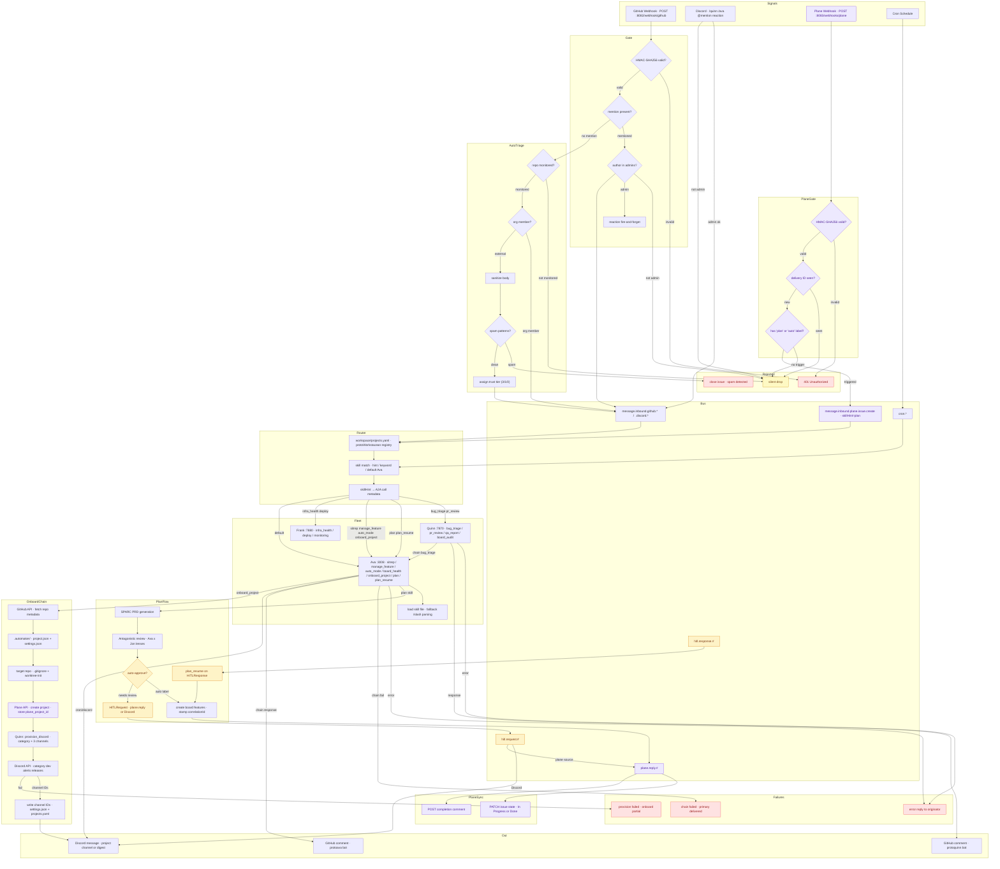

# A2A Plugin — Agent Routing & Chaining

Workspace plugin that bridges the Workstacean message bus to the protoLabs A2A agent fleet. protoWorkstacean is the authoritative source for the agent registry (`workspace/agents.yaml`) and project registry (`workspace/projects.yaml`). Inbound messages are matched to a skill, routed to the appropriate agent, and the response published back to the bus. The bus also handles HITL round-trips: interface plugins publish signals with `source`/`reply` metadata, and HITLRequests flow back through the same path for native rendering.

## Signal Flow



## Architecture

```
message.inbound.#
  → skill match (hint or keyword)
    → callA2A(agent, content, contextId)   ← JSON-RPC 2.0 / A2A spec
      → publishResponse(bus, outboundTopic)
        → runChain(nextAgent)              ← if chain configured
          → postGitHubComment / publishResponse
```

## Configuration

### Workspace Registry (protoWorkstacean repo)

The authoritative agent and project registries live in this repo under `workspace/`. The homelab-iac docker-compose mounts these into the container:

```yaml
# stacks/ai/docker-compose.yml  (homelab-iac repo)
volumes:
  - /home/josh/dev/protoWorkstacean/workspace:/workspace
```

### workspace/agents.yaml

Source of truth: `workspace/agents.yaml`

```yaml
agents:
  # Dev Team
  - name: ava
    team: dev
    url: http://automaker-server:3008/a2a
    apiKeyEnv: AVA_API_KEY
    skills:
      - sitrep
      - manage_feature
      - auto_mode
      - board_health
      - onboard_project
      - plan              # SPARC PRD + antagonistic review + HITL gate
      - plan_resume       # resume from SQLite checkpoint after HITL approval

  - name: quinn
    team: dev
    url: http://quinn:7870/a2a
    skills:
      - qa_report
      - board_audit
      - bug_triage
      - pr_review
    chain:
      bug_triage: ava

  - name: frank
    team: dev
    url: http://frank:7880/a2a
    skills:
      - infra_health
      - deploy
      - monitoring

  # GTM Team
  - name: jon
    team: gtm
    role: Strategy + Market positioning
    skills:
      - market_review
      - positioning
      - antagonistic_review   # called by Ava during plan skill

  - name: cindi
    team: gtm
    role: Content + SEO
    skills:
      - blog
      - seo
      - content_review

  # Knowledge
  - name: researcher
    team: knowledge
    role: Deep research + entity extraction
    skills:
      - research
      - entity_extract
```

### workspace/projects.yaml

Source of truth: `workspace/projects.yaml`

Enriched schema with `team`, `agents`, and Discord channels per project. Consumed by Quinn and protoMaker via `GET /api/projects`.

**Skills** declared in agents.yaml are used for routing fallback. On startup, the plugin fetches each agent's `/.well-known/agent.json` and overwrites with live skills if available.

**Chain** is optional. When `chain[skill]` is set, after the primary agent responds the plugin automatically calls the named agent with a prompt that includes the first agent's response plus the original context. One level deep only — no recursive chains.

### API Endpoints

| Endpoint | Method | Description |
|----------|--------|-------------|
| `/api/agents` | GET | Returns the full agent registry — consumed by Quinn, protoMaker |
| `/api/projects` | GET | Returns the full project registry with enriched metadata |
| `/publish` | POST | External services inject messages onto the bus (e.g., Ava publishing HITLRequests) |

### Env vars

| Variable | Required | Description |
|----------|----------|-------------|
| `AGENTS_YAML` | No | Path to agent registry (default: `/workspace/agents.yaml`) |
| `AVA_API_KEY` | If using Ava | API key injected as `X-API-Key` header |
| `AVA_APP_ID` | For chain comments | GitHub App ID — chain responses post as `protoava[bot]` |
| `AVA_APP_PRIVATE_KEY` | For chain comments | GitHub App private key (PKCS#1 PEM) |
| `QUINN_APP_ID` | For webhook comments | GitHub App ID — Quinn's responses post as `protoquinn[bot]` |
| `QUINN_APP_PRIVATE_KEY` | For webhook comments | GitHub App private key (PKCS#1 PEM) |

All env vars are stored in Infisical (AI project `11e172e0`) and injected at deploy time. See [homelab-iac stacks/ai/docker-compose.yml](https://github.com/protoLabsAI/homelab-iac/blob/main/stacks/ai/docker-compose.yml) for the full service definition.

## Skill Routing

Skills are matched in priority order:

1. **Explicit hint** — `payload.skillHint` bypasses keyword matching (set by GitHubPlugin, DiscordPlugin)
2. **Keyword match** — content scanned against `SKILL_KEYWORDS` table
3. **Default** — falls back to Ava

| Skill | Agent | Keywords |
|-------|-------|----------|
| `bug_triage` | Quinn | bug, issue, broken, crash, error, fail, exception, triage, TypeError, ReferenceError |
| `qa_report` | Quinn | report, qa, digest, quality, /report |
| `board_audit` | Quinn | audit, board, backlog, sprint, features, /audit |
| `pr_review` | Quinn | pr, pull request, review, merge, ci, /review |
| `sitrep` | Ava | status, sitrep, situation, summary, /sitrep |
| `manage_feature` | Ava | create feature, new feature, unblock, assign, move to, add to board |
| `board_health` | Ava | blocked, stalled, stuck, health, unhealthy |
| `auto_mode` | Ava | auto mode, start auto, stop auto, pause auto |
| `onboard_project` | Ava | onboard, new project, add project, /onboard |
| `plan` | Ava | idea, plan, build, proposal, project idea, /plan |
| `plan_resume` | Ava | (not keyword-matched — triggered by HITLResponse on bus with correlationId) |
| `provision_discord` | Quinn | (chain only — called by chain from onboard_project, not keyword-matched) |
| `infra_health` | Frank | infra, deploy, monitoring, node, container |
| `research` | Researcher | research, investigate, deep dive, entity, knowledge |

## A2A Protocol

Calls use `message/send` JSON-RPC 2.0:

```json
{
  "jsonrpc": "2.0",
  "id": "<uuid>",
  "method": "message/send",
  "params": {
    "message": { "role": "user", "parts": [{ "kind": "text", "text": "..." }] },
    "contextId": "workstacean-<channel>"
  }
}
```

`contextId` is derived from the message channel, so conversation threads persist across messages to the same channel.

Timeout: 120s per agent call.

## Chain Execution

When `chain[skill]` is configured:

1. Primary agent responds — response published to bus normally
2. Chain agent called with prompt:
   ```
   GitHub: owner/repo#number — <url>      ← if GitHub context present

   <primaryAgent> completed <skill> and responded:

   <firstResponse>

   Original report:
   <originalContent>
   ```
3. Chain response delivery:
   - **GitHub context present** → posted directly via GitHub API as `protoava[bot]`
   - **Otherwise** → published to the same bus outbound topic

## Bus Topics

| Topic | Direction | Description |
|-------|-----------|-------------|
| `message.inbound.#` | Subscribed | All inbound messages — routed by skill |
| `cron.#` | Subscribed | Cron events — routed by skill, reply to Discord |
| `message.outbound.*` | Published | Agent responses |
| `message.outbound.discord.push.<channel>` | Published | Cron responses to Discord |

## The Bug Triage Flywheel

The active chain is `quinn/bug_triage → ava/manage_feature`:

```
/quinn comment on GitHub issue
  → GitHubPlugin (webhook) → bus → A2APlugin
    → Quinn (bug_triage): classifies bug, may file board item via file_bug tool
      → posts triage comment to GitHub issue
    → Chain: Ava (manage_feature): reviews Quinn's triage, verifies board state
      → posts follow-up comment: feature link, close recommendation, or verification
```

Trigger: comment `@protoquinn <description>` on any issue in a webhook-connected repo (admin users only).

## HITL Flow Through the Bus

The `plan` and `plan_resume` skills implement a human-in-the-loop approval gate that routes through the bus back to whichever interface plugin originated the idea.

See [hitl.md](hitl.md) for full HITL plugin documentation, message types, and testing procedures.

### High-level flow

```
1. Signal arrives via any interface plugin
   → BusMessage with source: { interface: "discord", channelId, userId }
                     reply: { topic: "message.outbound.discord.push.<channel>", format: "embed" }

2. Workstacean routes to Ava (skillHint: "plan")
   → Ava generates SPARC PRD
   → Antagonistic Review: Ava (operational) x Jon (strategic)

3a. Auto-approved (both scores > 4.0)
    → Create project + features immediately
    → correlationId stamped on all artifacts

3b. HITL needed (either score <= 4.0)
    → Ava publishes HITLRequest to reply.topic
    → A2A returns: { status: "pending_approval", correlationId }
    → Interface plugin receives HITLRequest, renders natively:
        - Discord: embed with approve/reject buttons
        - Voice: spoken prompt with yes/no
        - Slack: interactive message with action buttons
        - API: webhook callback
    → Human responds
    → Interface plugin publishes HITLResponse on bus with correlationId
    → Workstacean routes to Ava (skillHint: "plan_resume")
    → Ava restores from SQLite checkpoint (plans.db, 7-day TTL)
    → Creates project + features, stamps correlationId
```

### Key Types (lib/types.ts)

- `BusMessage.source` — `{ interface: string, channelId: string, userId: string }`
- `BusMessage.reply` — `{ topic: string, format: string }`
- `HITLRequest` — `{ correlationId, question, options, prd, scores, replyTopic }`
- `HITLResponse` — `{ correlationId, decision, respondedBy, timestamp }`

### Design Principle

**The bus is dumb.** Interface plugins own rendering. Ava owns plan state. `correlationId` is the spine that connects them. Adding a new interface (e.g., Slack) requires only implementing the three plugin responsibilities — no changes to Ava or the bus.

## Adding a New Agent

1. Add the agent to `workspace/agents.yaml` with its URL and skills
2. Optionally add `chain` entries if it should trigger follow-up agents
3. Add keyword entries to `SKILL_KEYWORDS` in `a2a.ts` if keyword routing is needed
4. Restart the workstacean container: `docker restart workstacean`
