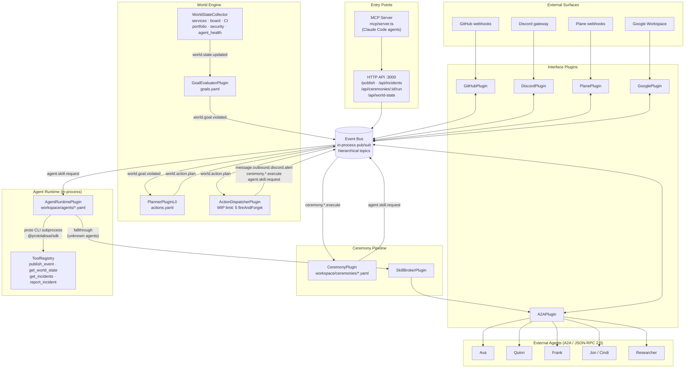
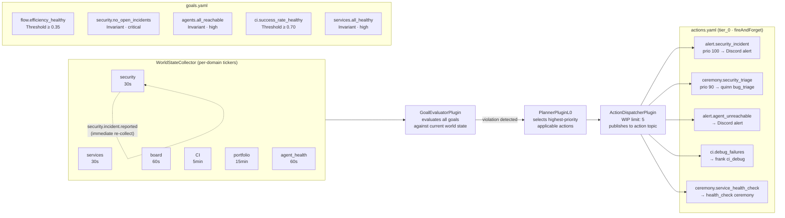
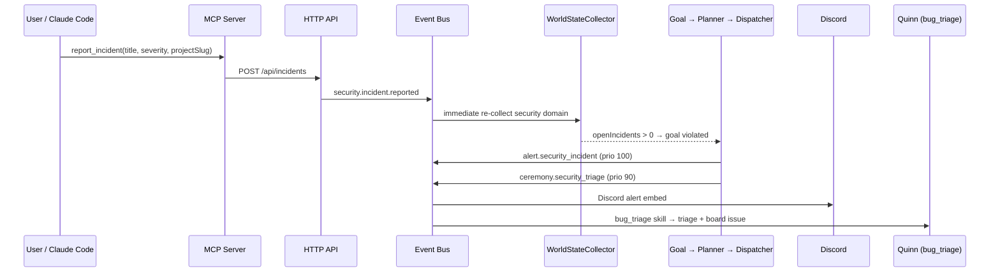

# Architecture — protoWorkstacean

protoWorkstacean is a homeostatic agent orchestration platform. It coordinates a fleet of AI agents across GitHub, Discord, Plane, and Google Workspace — and continuously monitors its own world state, acting autonomously to correct deviations from declared goals.

---

## System overview



---

## World Engine — GOAP homeostatic loop

The World Engine continuously monitors system state and autonomously closes deviations from declared goals. No human in the loop for routine corrections.



---

## Incident pipeline

When a security or operational incident is reported — via the MCP server, HTTP API, or a Claude Code agent — it flows through the full GOAP pipeline:



---

## Message routing conventions

```
message.inbound.github.<owner>.<repo>.<event>.<number>   — inbound from GitHub
message.outbound.github.<owner>.<repo>.<number>          — outbound to GitHub comment
message.inbound.discord.<channelId>                      — inbound from Discord
message.outbound.discord.<channelId>                     — outbound to Discord channel
agent.skill.request                                      — route to agent via SkillBroker
ceremony.<id>.execute                                    — trigger named ceremony
world.goal.violated                                      — GOAP goal deviation detected
world.action.plan                                        — planner output ready for dispatch
security.incident.reported                               — immediate security domain recollect
```

---

## Workspace config — tracked vs gitignored

| File | Purpose | Git |
|------|---------|-----|
| `workspace/actions.yaml` | GOAP action rules | tracked |
| `workspace/goals.yaml` | GOAP goal definitions | tracked |
| `workspace/ceremonies/*.yaml` | ceremony schedules + skill routing | tracked |
| `workspace/agents/*.yaml` | in-process agent definitions (model, tools, skills) | **gitignored** |
| `workspace/agents.yaml` | external A2A agent registry (URLs, chains) | **gitignored** |
| `workspace/projects.yaml` | project registry, Discord channels | **gitignored** |
| `workspace/discord.yaml` | bot config, slash commands | **gitignored** |
| `workspace/google.yaml` | Google Workspace config | **gitignored** |
| `workspace/incidents.yaml` | live security incident state | **gitignored** |

Copy `*.example` counterparts to bootstrap a new deployment.

---

## External services

| Service | Default URL | Purpose |
|---------|------------|---------|
| LiteLLM Gateway | `LLM_GATEWAY_URL` (default: `http://gateway:4000/v1`) | One-stop LLM routing for all in-process agents |
| Qdrant | `http://qdrant:6333` | Vector search (Quinn PR review) |
| Ollama | `http://ollama:11434` | Local embeddings |
| GitHub API | `https://api.github.com` | PRs, diffs, comments |
| Plane | `PLANE_BASE_URL` | Project board |
| Discord | bot token | Notifications, slash commands |
