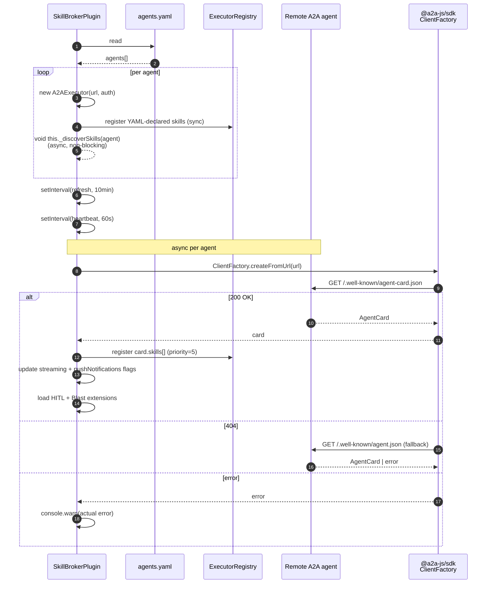

_On startup, SkillBrokerPlugin builds one A2AExecutor per agent in `workspace/agents.yaml`, then asynchronously fetches each agent's card to enroll their skills in the ExecutorRegistry. Refresh every 10 minutes; heartbeat every 60 seconds. Fix #608 made card-fetch failures fail loud at warn level._

---

## What & why

`AgentRuntimePlugin` enrolls in-process agents (Ava, Quinn, proto) synchronously at startup. Remote A2A agents (run as separate services on different hosts) can't be enrolled the same way — their skills are defined on the *agent side*, not in our config. Discovery solves this: ask each remote agent "what skills do you advertise?" via `/.well-known/agent-card.json`, register what they say.

Fix #608 ([PR #608](https://github.com/protoLabsAI/protoWorkstacean/pull/608)) made the failure path visible: a failed card fetch used to silent-catch and leave the agent dark with no log. Now it `console.warn`s the actual error.

---

## ASCII spine

```
   process startup
        │
        ▼
   ┌──────────────────────────┐
   │ SkillBrokerPlugin.install│
   │                          │
   │  1. read agents.yaml     │
   │  2. for each agent:      │
   │     a. create A2AExecutor│
   │     b. register YAML-    │
   │        declared skills   │
   │        (synchronous)     │
   │     c. fire _discover    │
   │        Skills() async    │
   │  3. start refresh timer  │  10 min
   │  4. start heartbeat timer│  60s
   └──────────────┬───────────┘
                  │
        async ────┘
        per agent
                  ▼
   ┌──────────────────────────┐
   │  _fetchCard(url)         │
   │                          │
   │  ClientFactory           │  via @a2a-js/sdk
   │   .createFromUrl(url)    │  primary: /.well-known/agent-card.json
   │   .getAgentCard()        │  fallback: /.well-known/agent.json
   │                          │
   │  fix #608: fail loud     │  console.warn on either path failure
   └──────────────┬───────────┘
                  │
                  ▼
   ┌──────────────────────────┐
   │ _discoverSkills()        │
   │                          │
   │  for each card.skills[]: │
   │    register skill in     │
   │    ExecutorRegistry      │  priority=5
   │                          │
   │  update executor caps    │
   │    streaming             │
   │    pushNotifications     │
   │                          │
   │  load extensions:        │
   │    HITL mode             │
   │    Blast declaration     │
   └──────────────────────────┘
```

---

## Sequence



---

## `workspace/agents.yaml` schema

[skill-broker-plugin.ts:40–70](../../src/plugins/skill-broker-plugin.ts):

```yaml
agents:
  - name: quinn                       # required
    url: http://quinn:7870/a2a        # required, A2A endpoint
    apiKeyEnv: QUINN_API_KEY          # legacy auth
    auth:                              # preferred (Phase 8)
      scheme: apiKey | bearer | hmac
      credentialsEnv: QUINN_API_KEY
    headers:                           # extra headers (extension opt-in)
      X-Foo: bar
    streaming: true                   # bootstrap assumption; card refreshes
    external: false                   # true if off-docker (Tailscale)
    skills:                           # yaml-declared overrides
      - name: bug_triage
        description: "…"
      - pr_review                     # short form
    subscribesTo:                     # future use
      - message.inbound.discord.#
```

The `skills:` field is a **bootstrap assumption** — registered synchronously so dispatch works during the async card-fetch window. Once the card arrives, **additional** skills are added but yaml-declared skills are not removed (they win on conflict).

---

## AgentCard shape (from remote)

Inferred from card-handling code at [skill-broker-plugin.ts:253–288](../../src/plugins/skill-broker-plugin.ts):

```ts
{
  skills: Array<{
    id: string,
    description?: string,
  }>,
  capabilities?: {
    streaming?: boolean,
    pushNotifications?: boolean,
    extensions?: Array<{
      uri: string,                  // identifier, e.g. "x-hitl-mode-v1"
      params?: Record<string, unknown>,
    }>,
  },
}
```

The card is the remote agent's source of truth. `streaming` and `pushNotifications` flags override our YAML assumption when the card arrives.

---

## Refresh + heartbeat timers

| Timer | Interval | What it does | File |
|---|---|---|---|
| Card refresh | 10 min (`CARD_REFRESH_INTERVAL_MS`) | Re-fetches each card → re-enrolls skills + updates capability flags. New skills added; removed skills... not currently un-enrolled. | `skill-broker-plugin.ts` |
| Heartbeat | 60s (`HEARTBEAT_INTERVAL_MS`) | Liveness probe; feeds fleet health. | `skill-broker-plugin.ts` |

---

## JSON-RPC envelope

A2A protocol is JSON-RPC 2.0, but `SkillBrokerPlugin` and `A2AExecutor` do **not** construct the envelope directly — `@a2a-js/sdk` does. From our side:

- **Card fetch:** `client.getAgentCard()` → SDK wraps as JSON-RPC method
- **Skill dispatch:** `A2AExecutor.execute()` → SDK constructs `message/send` JSON-RPC envelope
- **Auth headers:** `A2AExecutor.buildFetch()` ([line 119–159](../../src/executor/executors/a2a-executor.ts)) stamps `X-API-Key` or `Authorization: Bearer`
- **Trace headers:** same `buildFetch()` injects `X-Correlation-Id`, `X-Parent-Id`

You can't inspect the raw JSON-RPC envelope without forking the SDK.

---

## Failure modes & gotchas (fix #608 made these visible)

- **Card fetch is async, non-blocking** ([line 121–194](../../src/plugins/skill-broker-plugin.ts)) — if an agent's card is slow at startup, the broker registers zero skills initially and dispatch returns "No executor found" until the async fetch completes. **Mitigation:** declare skills in `workspace/agents.yaml` to bootstrap.
- **Stale hostnames don't fail loudly until #608** — pre-#608, a DNS-unresolvable agent hostname (e.g. `old-agent-host` after rename to `new-agent-host`) silent-caught at `_fetchCard` and the agent was dark forever. Post-#608, `console.warn` fires on every retry.
- **Both card paths can fail with different errors** — primary at `/.well-known/agent-card.json`, fallback at `/.well-known/agent.json`. Fix #608 captures and logs both ([line 361–398](../../src/plugins/skill-broker-plugin.ts)).
- **Card refresh doesn't unregister removed skills** — if a remote agent drops a skill from its card, the old registration sticks until restart. Acceptable today (skill removals are rare); revisit if dynamic skill mutation becomes common.
- **Extensions are optional and silent on miss** — `card.capabilities.extensions` not advertising the HITL or Blast URI = no-op load. Easy to forget you needed to add the extension to a new agent.

---

## Related

- [flow-inbound-message](flow-inbound-message.md) — what happens after an A2A skill is dispatched
- [chokepoint-invariants](chokepoint-invariants.md) — #444 target guard runs against this registry
- [flow-agent-runtime-telemetry](flow-agent-runtime-telemetry.md) — telemetry from A2A executions
