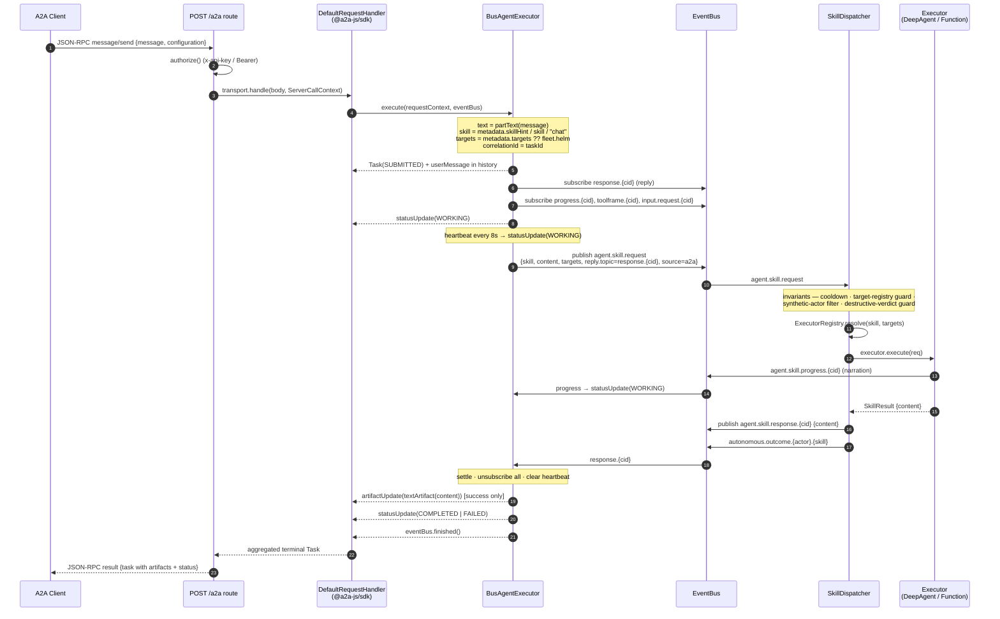
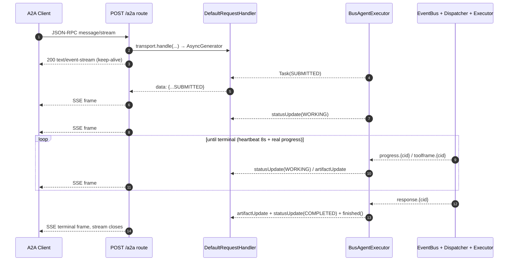
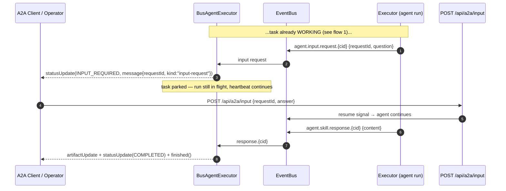
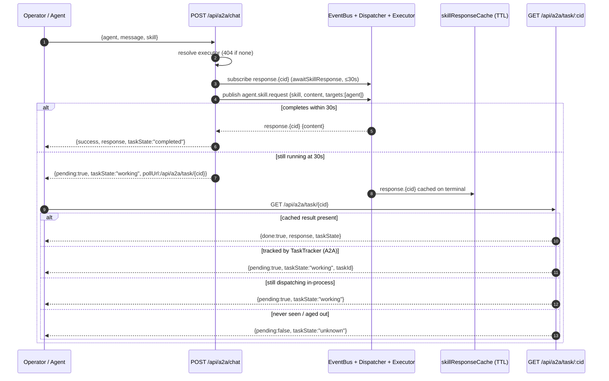
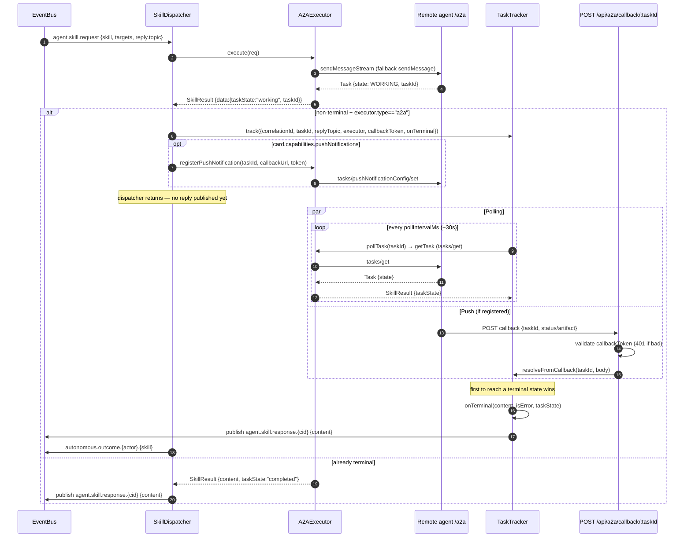

# A2A flows — end-to-end sequence audit

This page traces every A2A (Agent-to-Agent protocol) path through the switchboard,
from the wire down to the bus and back. It is an audit of the *actual* code, not an
idealized model — each step cites the file that implements it.

protoWorkstacean sits on **both** sides of A2A:

- **Inbound (server):** an external A2A client calls `POST /a2a`. `BusAgentExecutor`
  bridges the JSON-RPC `RequestContext` onto the bus and translates bus replies back
  into A2A task events. (`src/api/a2a-server.ts`)
- **Outbound (client):** the dispatcher resolves a skill to an `A2AExecutor`, which
  calls a *remote* agent's `/a2a`. Long-running remote tasks are driven to completion
  by `TaskTracker` (poll) and/or `POST /api/a2a/callback/:taskId` (push).
  (`src/executor/executors/a2a-executor.ts`, `src/executor/task-tracker.ts`)

The bus is the seam. Neither side knows whether the other end is an in-process
DeepAgent, a remote A2A agent, or a function handler — the dispatcher picks the
executor and everyone publishes/subscribes the same topics.

## Key invariants

| Fact | Where |
| --- | --- |
| `correlationId === A2A taskId` on the inbound path | `a2a-server.ts` (`correlationId = taskId`) |
| Reply topic is `agent.skill.response.{correlationId}` | dispatcher `replyTopic`, server `replyTopic` |
| Terminal state **is** the done signal (no `final:true` flag — A2A 1.0) | `a2a-server.ts:297` |
| All chokepoint invariants live in the dispatcher, not the surfaces | `skill-dispatcher-plugin.ts` |
| The answer is emitted as a terminal **Artifact** (clients read `task.artifacts`) | `a2a-server.ts:308` |
| Async A2A handoff gates on `executor.type === "a2a"` | `skill-dispatcher-plugin.ts:373` |

## Topic map

```
agent.skill.request                 BusAgentExecutor / chat API → SkillDispatcher (sole subscriber)
agent.skill.response.{cid}          dispatcher / TaskTracker → reply subscriber           (= replyTopic)
agent.skill.progress.{cid}          executor → server (→ statusUpdate WORKING)
agent.skill.toolframe.{cid}         executor (tool-call-v1) → server (→ artifactUpdate)
agent.input.request.{cid}           HITL gate → server (→ statusUpdate INPUT_REQUIRED)
autonomous.outcome.{actor}.{skill}  dispatcher → telemetry (on terminal)
```

---

## 1. Inbound — synchronous `message/send`

The default external call. `DefaultRequestHandler` (from `@a2a-js/sdk`) collects task
events off the execution event bus and returns the aggregated terminal `Task` as a
single JSON-RPC response. `BusAgentExecutor.execute()` does not resolve its promise
until the bus reply arrives (or cancel/timeout), so the HTTP response blocks to
terminal.



**Failure/HTML-error handling:** if the reply `error` (or `content`) looks like an HTML
error page (a misrouted upstream A2A sub-call), it is sanitized and the task settles
`FAILED` with the cleaned text on `status.message` (`a2a-server.ts:283-301`,
`looksLikeHtmlError`/`sanitizeHtmlError`).

---

## 2. Inbound — streaming `message/stream` (SSE)

Same bridge, different transport. `transport.handle()` returns an `AsyncGenerator`;
the route pipes each `AgentEvent` as a `text/event-stream` chunk so the client sees
state transitions live instead of one terminal blob.



The 8s heartbeat (`A2A_STREAM_HEARTBEAT_MS`) exists because a long in-process
DeepAgent turn (20–40s) emits no bytes between `WORKING` and terminal, and idle-timeout
proxies cut a byte-silent SSE stream (~10s observed). (`a2a-server.ts:371-392`)

---

## 3. Inbound — input-required (HITL interrupt)

When the agent run blocks on a tool that needs human input, it publishes
`agent.input.request.{cid}`. The server parks the task in `INPUT_REQUIRED` (non-final —
the stream stays warm) and rides the `requestId` on message metadata so the operator can
answer the specific request via `POST /api/a2a/input`.



Cancel path: `TaskStore.cancelTask()` → `BusAgentExecutor.cancelTask()` fires the
`activeCancels` hook → `statusUpdate(CANCELED)` + `finished()` (`a2a-server.ts:333-356,
418-421`).

---

## 4. Operator HTTP chat — `POST /api/a2a/chat` + poll

The fleet's own agents (and the dashboard) drive other agents through a thin HTTP
wrapper rather than raw JSON-RPC. Same bus spine. `handleChat` awaits the reply up to
`A2A_CHAT_REPLY_TIMEOUT_MS` (30s); if it times out, it returns `pending` + a `pollUrl`.
The result is later retrieved from `skillResponseCache` (TTL buffer fed by a
response-topic subscriber) or, for remote A2A, from `TaskTracker`.



> Deployed prod additionally supports an explicit `returnImmediately:true` body flag
> that skips the await entirely and returns `taskState:"submitted"` + `pollUrl` in
> ~30ms (used for long deep-research / pentest runs). The timeout-based pending path
> above is the floor beneath it. `POST /api/a2a/delegate` is the fire-and-forget
> variant (always returns a `pollUrl` immediately). (`ava-tools.ts`)

---

## 5. Outbound — dispatcher → remote A2A agent (poll + push)

When `ExecutorRegistry.resolve()` returns an `A2AExecutor`, the dispatcher calls a
*remote* agent's `/a2a`. If the remote returns a **non-terminal** state with a `taskId`,
the dispatcher does **not** publish a reply — it hands the task to `TaskTracker` and
returns. The tracker then drives the task to terminal via **polling** (`tasks/get`)
and/or a **push callback** (`/api/a2a/callback/:taskId`), and only then publishes to the
reply topic.



**Callback routing** (`skill-dispatcher-plugin.ts:418-441`,
`a2a-executor.ts:_pickCallbackBaseUrl`): docker-internal agents (e.g. `http://quinn:7870`)
get `WORKSTACEAN_INTERNAL_BASE_URL`; agents flagged `external:true` or with dotted
hostnames get `WORKSTACEAN_BASE_URL` (the public/Tailscale URL). Push is only registered
when the agent's card advertises `capabilities.pushNotifications=true` (refreshed every
10 min by `SkillBrokerPlugin`); otherwise the tracker falls back to polling only.

**Restart durability:** `TaskTracker` rehydrates in-flight tasks from SQLite on boot and
the push store (`SqlitePushNotificationStore`) survives container restarts, so a task
in flight across a redeploy still gets its reply published. (`a2a-server.ts:432-434`,
`task-tracker.ts:117-126`)

---

## 6. Composed picture — the full loop

A single inbound A2A call can fan all the way out to a remote agent and back, because
the inbound bridge and the outbound executor share the bus:

```
external client → /a2a → BusAgentExecutor ─┐
                                            ├─ agent.skill.request ─→ SkillDispatcher
operator → /api/a2a/chat ───────────────────┘                              │
                                                                           resolve
                                              ┌──────────────┬─────────────┴───────────┐
                                       DeepAgentExecutor   FunctionExecutor       A2AExecutor
                                        (in-process)       (alert/ceremony)      (remote /a2a)
                                              │                  │                     │
                                              └── agent.skill.response.{cid} ──────────┘
                                                            │
                                  ┌─────────────────────────┼──────────────────────────┐
                          BusAgentExecutor             skillResponseCache          TaskTracker
                          → A2A task events            → poll endpoint             (poll + callback)
```

The dispatcher is the only subscriber to `agent.skill.request`, and the only place the
four chokepoint invariants run — so every surface (inbound A2A, operator chat, ceremony,
webhook) inherits them for free.

## Failure modes & gotchas

- **Upstream HTML error leaks as the answer.** A misrouted A2A sub-call (wrong card URL)
  can return `<!DOCTYPE html>…Cannot POST /…` on the reply payload. `looksLikeHtmlError`
  detects it, logs the raw payload loudly, and settles the task `FAILED` with sanitized
  text instead of surfacing HTML as the assistant reply. (`a2a-server.ts:283-301`)
- **Byte-silent SSE gets cut.** A 20–40s in-process turn emits nothing between `WORKING`
  and terminal; idle-timeout proxies kill the stream (~10s). The 8s `WORKING` heartbeat
  (`A2A_STREAM_HEARTBEAT_MS`) is the floor that keeps it warm. (`a2a-server.ts:371-392`)
- **Async handoff is A2A-only.** Only `executor.type === "a2a"` non-terminal results go to
  `TaskTracker`; an in-process executor that returned a working-state taskId would be
  ignored by the tracker. In-process long runs surface via the poll endpoint's
  `activeDispatchCheck` instead. (`skill-dispatcher-plugin.ts:373`, `ava-tools.ts:272`)
- **Push needs a card capability + reachable callback URL.** Registration is skipped
  unless `card.capabilities.pushNotifications=true`; the callback base URL is chosen by
  `_pickCallbackBaseUrl` (internal vs external), and a wrong choice means the remote can't
  reach us — the task then completes via polling only. (`skill-dispatcher-plugin.ts:418-441`)
- **Callback token mismatch → 401.** `/api/a2a/callback/:taskId` rejects any body whose
  notification token doesn't match the one minted at `track()` time, so a stale or spoofed
  push can't resolve a task. (`a2a-callback.ts:44-49`)
- **Result aged out → `unknown`.** The poll endpoint returns `taskState:"unknown"` once a
  result has left `skillResponseCache` (TTL) and the task isn't tracked or dispatching —
  callers must not treat `unknown` as "failed". (`ava-tools.ts:279-287`)
- **Restart mid-flight.** `TaskTracker` rehydrates in-flight tasks from SQLite and the
  push store is SQLite-backed, so a task in flight across a redeploy still gets its reply
  published. (`task-tracker.ts:117-126`, `a2a-server.ts:432-434`)

## Source map

| Concern | File |
| --- | --- |
| Inbound `/a2a` server, `BusAgentExecutor`, routes | `src/api/a2a-server.ts` |
| Agent card (`/.well-known/agent-card.json`) | `src/api/agent-card.ts` |
| Operator chat / delegate / poll | `src/api/ava-tools.ts` |
| HITL answer (`/api/a2a/input`) | `src/api/human-input.ts` |
| Inbound push ingress (`/api/a2a/callback/:taskId`) | `src/api/a2a-callback.ts` |
| Dispatch chokepoint + async handoff + push registration | `src/executor/skill-dispatcher-plugin.ts` |
| Outbound A2A client | `src/executor/executors/a2a-executor.ts` |
| Long-running task lifecycle (poll/callback/rehydrate) | `src/executor/task-tracker.ts` |
