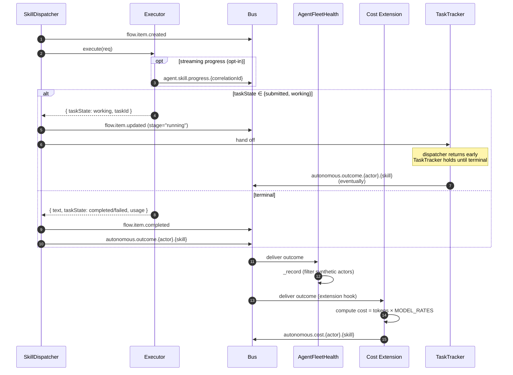

_How executors publish "I started", "I'm progressing", "I finished" — and what those signals feed. The story today is simpler than memory suggests: `flow.item.*`, `autonomous.outcome.*`, and opt-in `agent.skill.progress.*` are the real topics. Several often-referenced topics (`agent.runtime.activity.tool.call`, `agent.skill.latency`) are aspirational._

---

## What & why

Three consumers care about executor lifecycle: AgentFleetHealth (rolling-window health snapshots), the dashboard (live tiles), and the cost extension (per-call usage → cost). They observe the dispatcher and executors from the side; the agent runtime doesn't know they're listening.

---

## ASCII spine

```
                              ┌──────────────────────────┐
                              │ SkillDispatcher          │
                              │  publishes lifecycle:    │
                              │                          │
                              │  flow.item.created       │ ← dispatch start
                              │  flow.item.updated       │ ← running / error
                              │  flow.item.completed     │ ← terminal success
                              │  autonomous.outcome.     │ ← canonical terminal
                              │    {actor}.{skill}       │
                              └──────────┬───────────────┘
                                         │
   ┌──────────────────────────┐          │
   │ Executor (Deep/Proto/A2A)│          │
   │  may publish (opt-in):   │          │
   │                          │          │
   │  agent.skill.progress.   │ ─────────┤
   │    {correlationId}       │          │
   └──────────────────────────┘          │
                                         │
                              ┌──────────┼───────────┬──────────────────┐
                              ▼          ▼           ▼                  ▼
                         ┌─────────┐ ┌──────────┐ ┌─────────────┐ ┌────────────┐
                         │ Fleet   │ │ Cost     │ │ Dashboard   │ │TaskTracker │
                         │ Health  │ │ Extension│ │ tiles       │ │(A2A async) │
                         │         │ │          │ │             │ │            │
                         │ 24h     │ │ CostSampl│ │ live event  │ │ owns       │
                         │ window  │ │ es,      │ │ feed via    │ │ outcome    │
                         │         │ │ autonom. │ │ BusHistory  │ │ publish    │
                         │         │ │ cost.*   │ │ Recorder    │ │ for long-  │
                         │         │ │          │ │             │ │ running    │
                         └─────────┘ └──────────┘ └─────────────┘ └────────────┘
```

---

## Sequence



---

## Bus topic table

| Topic | Published by | Subscribed by | File:line |
|---|---|---|---|
| `flow.item.created` | SkillDispatcher | dashboard / BusHistoryRecorder | `src/executor/skill-dispatcher-plugin.ts:275` |
| `flow.item.updated` | SkillDispatcher (running/error states) | dashboard | `:370,385,457` |
| `flow.item.completed` | SkillDispatcher | dashboard | `:418` |
| `agent.skill.progress.{correlationId}` | executor (opt-in) | dashboard / SSE streamer | `src/event-bus/payloads.ts:86–95` |
| `autonomous.outcome.{systemActor}.{skill}` | SkillDispatcher (or TaskTracker for async) | AgentFleetHealth, Cost extension | `src/executor/skill-dispatcher-plugin.ts:538` |
| `autonomous.cost.{systemActor}.{skill}` | Cost extension after-hook | dashboard (fleet-cost tile) | `src/executor/extensions/cost.ts:209` |

---

## `AutonomousOutcomePayload` shape

[src/event-bus/payloads.ts:261–296](../../src/event-bus/payloads.ts):

```ts
{
  correlationId: string,
  parentId?: string,
  systemActor: string,           // agent name or plugin label
  skill: string,
  actionId?: string,             // ceremony or action ID
  goalId?: string,
  success: boolean,
  error?: string,
  taskState?: string,            // A2A terminal state
  textPreview?: string,          // first 500 chars
  usage?: {
    input_tokens?: number,
    output_tokens?: number,
    cache_creation_input_tokens?: number,
    cache_read_input_tokens?: number,
  },
  durationMs: number,
  effectDelta?: Record<string, unknown>,  // reserved
}
```

`durationMs` is wall-clock from dispatch to terminal; `usage` is forwarded from the LLM provider (LiteLLM gateway).

---

## `AgentSkillProgressPayload` shape

[src/event-bus/payloads.ts:86–95](../../src/event-bus/payloads.ts):

```ts
{
  text?: string,         // human-readable progress message
  percent?: number,      // 0–100
  step?: string,         // named phase (e.g. "fetching", "processing")
  meta?: Record<string, unknown>,
}
```

**Opt-in.** Both DeepAgentExecutor and A2AExecutor have the hook plumbing but neither currently publishes progress. The A2AExecutor's `onStreamUpdate` callback is wired for the SDK side but does **not** translate to bus events. Tile-watching for "what is Quinn doing right now" returns silence today.

---

## TaskTracker hand-off (long-running A2A)

When an executor returns `taskState ∈ {submitted, working}`, the dispatcher hands off ownership to `TaskTracker` and returns early ([skill-dispatcher-plugin.ts:293–378](../../src/executor/skill-dispatcher-plugin.ts)). TaskTracker owns:

- Polling / push-notification handling for the A2A task
- Publishing `autonomous.outcome.{actor}.{skill}` when the task finally reaches a terminal state
- Cleaning up `activeExecutions` slot

This means **autonomous.outcome is sometimes published by TaskTracker, not the dispatcher**. Subscribers don't need to care (same payload shape), but if you're tracing a missing outcome, check both.

---

## Runtime activity + skill latency topics

The dispatcher and runtime publish a richer set of lifecycle events than `autonomous.outcome.*` alone:

| Topic | Published at | What it carries |
|---|---|---|
| `agent.runtime.activity.skill.start` | `skill-dispatcher-plugin.ts:110` (declared in `publishes`) | dispatch start — agent name, skill, correlationId |
| `agent.runtime.activity.skill.complete` | same | dispatch terminal — outcome + duration |
| `agent.runtime.activity.skill.error` | same | dispatch failure — error + duration |
| `agent.runtime.activity.tool.call` | `agent-runtime-plugin.ts:94` (via `_publishToolCall` hook fed by DeepAgent at `deep-agent-executor.ts:743` and ProtoSdk at `proto-sdk-executor.ts:100`) | per-tool invocation — agent, correlationId, skill, toolNames[] |
| `agent.skill.latency` | `skill-dispatcher-plugin.ts:482` | structured latency — skill, totalMs, queueMs, executeMs, optional github {owner,repo,number} |

The `_publishToolCall` callback is wired uniformly in `AgentRuntimePlugin.install()` and passed into both DeepAgent and ProtoSdk executor constructors — same hook, same topic, regardless of runtime.

`agent.skill.latency` is best-effort (`try`/`catch` at line 497) — a publish failure can't poison the success path.

---

## Cost extension

[src/executor/extensions/cost.ts](../../src/executor/extensions/cost.ts) hooks the dispatcher *after* the executor returns. Pipeline:

1. `cost.beforeExecute` — records start time
2. Executor runs
3. `cost.afterExecute` — reads `result.usage`, computes:
   ```
   costUsd = input_tokens × MODEL_RATES[model].input
           + output_tokens × MODEL_RATES[model].output
   ```
4. Publishes `autonomous.cost.{systemActor}.{skill}` ([line 209](../../src/executor/extensions/cost.ts))
5. CostStore in-memory aggregator collects samples for the `/api/cost-summaries` dashboard route

**Gotcha:** `MODEL_RATES` is hard-coded ([lib/types/budget.ts](../../lib/types/budget.ts)). New models from LiteLLM gateway are zero-cost until the table is updated.

---

## Failure modes & gotchas

- **Progress topics are silent today** — no executor publishes `agent.skill.progress.*`. Dashboard tiles relying on them show nothing.
- **TaskTracker outcome publish is the canonical path for long-running A2A** — if you're debugging "outcome never fires", check whether the task is parked in TaskTracker (likely) or actually never completed (unlikely).
- **Latency is `durationMs` on outcomes + structured `agent.skill.latency` on success** — `autonomous.outcome.*.durationMs` is wall-clock; `agent.skill.latency` adds queueMs/executeMs split + optional GitHub PR context. Aggregate at the consumer for p50/p95 ([flow-alert-remediator](flow-alert-remediator.md) does this from outcomes).
- **`systemActor` is whatever the dispatcher writes** — it's not validated by the bus. Synthetic actors (`feature-remediation`, `user`) coexist with real agents. The synthetic-actor filter at FleetHealth ([#459](chokepoint-invariants.md)) is the source of truth for "is this a real agent."

---

## Related

- [chokepoint-invariants](chokepoint-invariants.md) — #459 synthetic-actor filter consumes these
- [flow-inbound-message](flow-inbound-message.md) — where the dispatcher actually publishes
- [flow-alert-remediator](flow-alert-remediator.md) — how outcomes become alerts
- [flow-dashboard](flow-dashboard.md) — where the topics surface visually
