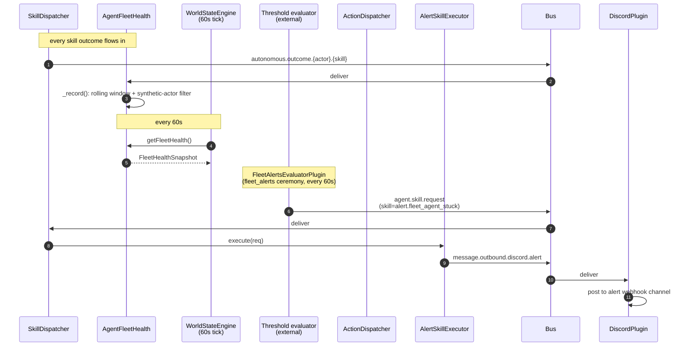
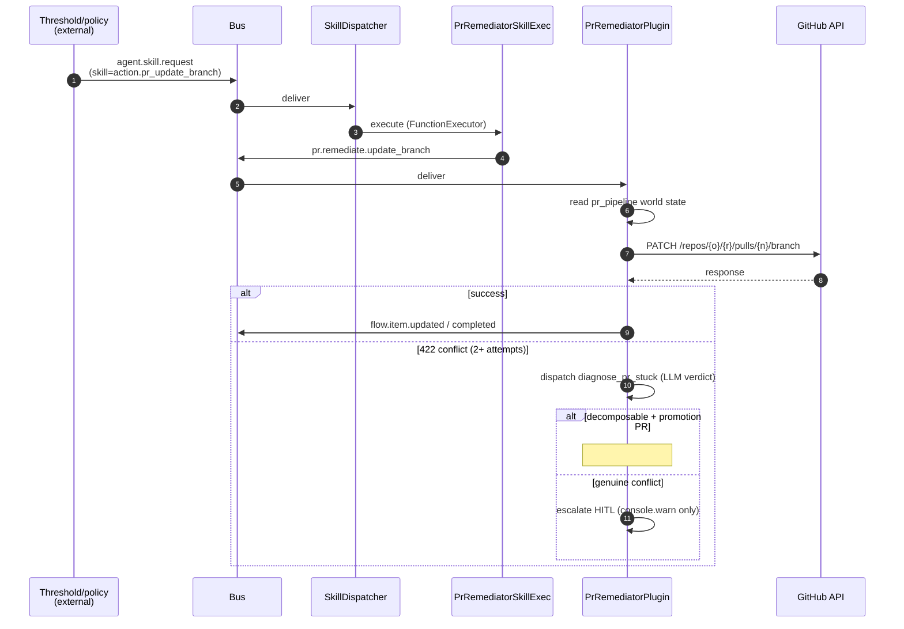

_The fleet self-healing path: AgentFleetHealth aggregates outcomes into a snapshot; the `fleet_alerts` ceremony polls thresholds every minute and dispatches `alert.*` skills on violation; pr-remediator handles `pr.remediate.*` topics that propose code mutations._

---

## What & why

The fleet is a distributed system; agents fail, PRs get stuck, costs spike. Two related paths handle the response:

- **Alerts** — declarative skill executors (20 of them) that turn a `alert.fleet_*` skill dispatch into a Discord message. Fire-and-forget, no LLM.
- **PR remediator** — five `pr.remediate.*` topics (`update_branch`, `merge_ready`, `fix_ci`, `address_feedback`, `pr.backmerge.dispatch`) that consume an action dispatch and mutate the PR via GitHub API.

Both are `FunctionExecutor`-backed (no LLM at the executor itself; LLM lives one layer deeper in `pr-remediator` for `diagnose_pr_stuck`).

---

## ASCII spine

```
   autonomous.outcome.# (from every skill execution)
        │
        ▼
   ┌──────────────────────────┐
   │ AgentFleetHealthPlugin   │  rolling 24h windows
   │   _record()              │  synthetic actor filter (#459)
   │                          │
   │   computes:              │
   │   • successRate          │
   │   • failureRate1h        │
   │   • p50/p95 latency      │
   │   • cost per outcome     │
   │   • orphanedSkillCount   │
   │   • maxFailureRate1h     │
   └──────────────┬───────────┘
                  │ exposed via getFleetHealth() collector
                  ▼  (called by WorldStateEngine every 60s)
   ┌──────────────────────────┐
   │  world-state domain:     │
   │  agent_fleet_health      │
   └──────────────┬───────────┘
                  │
                  ▼   (?) threshold evaluation
                  │       fleet_alerts ceremony polls every 60s
                  ▼
   ┌──────────────────────────┐  ┌──────────────────────────┐
   │ alert.fleet_agent_stuck  │  │ action.pr_update_branch  │
   │ alert.fleet_skill_       │  │ action.pr_fix_ci         │
   │   orphaned               │  │ action.pr_address_       │
   │ alert.fleet_cost_over_   │  │   feedback               │
   │   budget                 │  │ action.pr_merge_ready    │
   │ … (20 alert skills)      │  │ action.pr_backmerge      │
   └──────────────┬───────────┘  └──────────────┬───────────┘
                  │                              │
                  ▼  SkillDispatcher              ▼  SkillDispatcher
   ┌──────────────────────────┐  ┌──────────────────────────┐
   │ AlertSkillExecutorPlugin │  │ PrRemediatorSkillExec.   │
   │  → message.outbound.     │  │  → pr.remediate.{action} │
   │      discord.alert       │  │                          │
   └──────────────────────────┘  └──────────────┬───────────┘
                                                 │
                                                 ▼
                                  ┌──────────────────────────┐
                                  │ PrRemediatorPlugin       │
                                  │  reads pr_pipeline state │
                                  │  publishes GitHub mut.   │
                                  │  or HITL escalation      │
                                  └──────────────────────────┘
```

---

## Sequence (alert path)



## Sequence (PR remediator path)



---

## Bus topic table

### Fleet health

| Topic | Published by | Subscribed by | File:line |
|---|---|---|---|
| `autonomous.outcome.#` | SkillDispatcher | AgentFleetHealthPlugin | `src/plugins/agent-fleet-health-plugin.ts:159` |
| `agent_fleet_health` (world-state) | FleetHealth.getFleetHealth() collector | WorldStateEngine | `src/plugins/agent-fleet-health-plugin.ts:180` |

### Alerts (20 skills total — sample)

| Skill (on `agent.skill.request`) | Severity | Outbound topic |
|---|---|---|
| `alert.fleet_agent_stuck` | high | `message.outbound.discord.alert` |
| `alert.fleet_skill_orphaned` | medium | `message.outbound.discord.alert` |
| `alert.fleet_cost_over_budget` | high | `message.outbound.discord.alert` |
| … (full list in `AlertSkillExecutorPlugin.ALERT_SKILLS`, [line 39–67](../../src/plugins/AlertSkillExecutorPlugin.ts)) | | |

All 20 are `FunctionExecutor` registrations with priority=5, fire-and-forget, no LLM.

### PR remediator

| Skill | Topic published | Handler in `pr-remediator.ts` |
|---|---|---|
| `action.pr_update_branch` | `pr.remediate.update_branch` | line 1006+ |
| `action.pr_merge_ready` | `pr.remediate.merge_ready` | line 985+ |
| `action.pr_fix_ci` | `pr.remediate.fix_ci` | line 750+ |
| `action.pr_address_feedback` | `pr.remediate.address_feedback` | line 750+ |
| `action.pr_backmerge` | `pr.backmerge.dispatch` | line 6+ |

PrRemediatorSkillExecutorPlugin maps skill→topic; PrRemediatorPlugin subscribes to all five.

---

## Synthetic actor filter (#459)

Lives at [AgentFleetHealthPlugin._record:281–334](../../src/plugins/agent-fleet-health-plugin.ts). Detail in [chokepoint-invariants](chokepoint-invariants.md).

Summary: `pr-remediator`, `goap`, `user` are recognized synthetic actors. Their outcomes go into `systemActors[]` bucket (not `agents[]`) so they don't inflate `agentCount` or skew `maxFailureRate1h`.

---

## Threshold evaluation (via fleet_alerts ceremony)

Resolved by **#621** — the GOAP layer that previously evaluated thresholds was ripped in **#518** (2026-05-23), leaving the 20 `alert.*` skills as orphaned dead code for 3 days. The reconnect uses the existing ceremony spine instead of resurrecting GOAP:

```
workspace/ceremonies/fleet-alerts.yaml
  schedule: * * * * *               every minute
  skill: evaluate_fleet_thresholds

src/plugins/fleet-alerts-evaluator-plugin.ts
  registers evaluate_fleet_thresholds (FunctionExecutor)

  on dispatch (every minute):
    1. snapshot = AgentFleetHealthPlugin.getFleetHealth()
    2. for each tripped threshold:
         bus.publish("agent.skill.request", { skill: "alert.X", meta: { metric, value, threshold } })
    3. per-alert cooldown (15min default) suppresses repeats
```

**Three thresholds wired today** (env-overridable):

| Alert | Trigger | Default | Env |
|---|---|---|---|
| `alert.fleet_agent_stuck` | `maxFailureRate1h > 0.5` | 50% | `WORKSTACEAN_FLEET_FAILURE_RATE_THRESHOLD` |
| `alert.fleet_cost_over_budget` | `totalCostUsd1d > $50` | $50/day | `WORKSTACEAN_FLEET_DAILY_BUDGET_USD` |
| `alert.fleet_skill_orphaned` | `orphanedSkillCount > 0` | 0 | (fixed) |

**The other 17 alert skills** remain unwired — they need data sources outside fleet-health (GitHub branch protection, CI failure history, security state). Same state as before #621; surfacing as known work, not regression.

---

## PR remediator state machine

PrRemediatorPlugin (`lib/plugins/pr-remediator.ts`) maintains in-memory `inFlight` Map per PR:

```
InFlightEntry {
  attemptCount,
  escalated,
  diagnostics?,
  …
}
```

Key transitions ([pr-remediator.ts:604+](../../lib/plugins/pr-remediator.ts)):
- Fresh PR → enter inFlight, attempt = 0
- Each `pr.remediate.*` consume → attempt += 1, try GitHub mutation
- Attempt count ≥ `MAX_ATTEMPTS_PER_PR` (3) → mark escalated, emit HITL (see gap in [flow-hitl](flow-hitl.md))
- 422 conflict on `update_branch` after 2 attempts → dispatch `diagnose_pr_stuck` for LLM verdict
- Verdict `genuine` → immediate HITL
- Verdict `decomposable` + promotion PR → suppress close, HITL (defense-in-depth #465)

---

## Failure modes & gotchas

- **Live CI re-check before fix_ci escalation** ([line 821–830](../../lib/plugins/pr-remediator.ts)) — before emitting HITL for "stuck on CI", pr-remediator hits GitHub live API to confirm CI is still red. If it flipped green between snapshot and escalation, the escalation is silently dropped. Prevents stale-snapshot false alarms.
- **Alert thresholds are hard-coded in source** — `WINDOW_MS = 24h`, `MAX_RECENT_FAILURES = 10`. No env override. Changing these requires a rebuild.
- **Cost calculation depends on `MODEL_RATES`** ([lib/types/budget.ts](../../lib/types/budget.ts)) — hard-coded model price table. When LiteLLM gateway adds a new model, this table must be updated or `costUsd` is zero for that model.
- **Outcome attribution is write-time, not read-time** ([line 281](../../src/plugins/agent-fleet-health-plugin.ts)) — `systemActor` is bucketed *as outcomes arrive*. If `ExecutorRegistry` enrolls a new agent later, prior outcomes for that name stay in `systemActors[]`. Restart required to re-bucket.
- **`agent.runtime.activity.tool.call` and `agent.skill.latency` topics are referenced in some commentary but NOT in source** ([all-topics.ts](../../src/event-bus/all-topics.ts)) — see [flow-agent-runtime-telemetry](flow-agent-runtime-telemetry.md). If a tile or alert depends on them, it's broken today.

---

## Related

- [chokepoint-invariants](chokepoint-invariants.md) — #459 synthetic actor filter, #465 destructive verdict guard
- [flow-hitl](flow-hitl.md) — the escalation path (with the wire-incomplete gap)
- [flow-agent-runtime-telemetry](flow-agent-runtime-telemetry.md) — what feeds the snapshot
- [flow-dashboard](flow-dashboard.md) — how the snapshot is rendered
