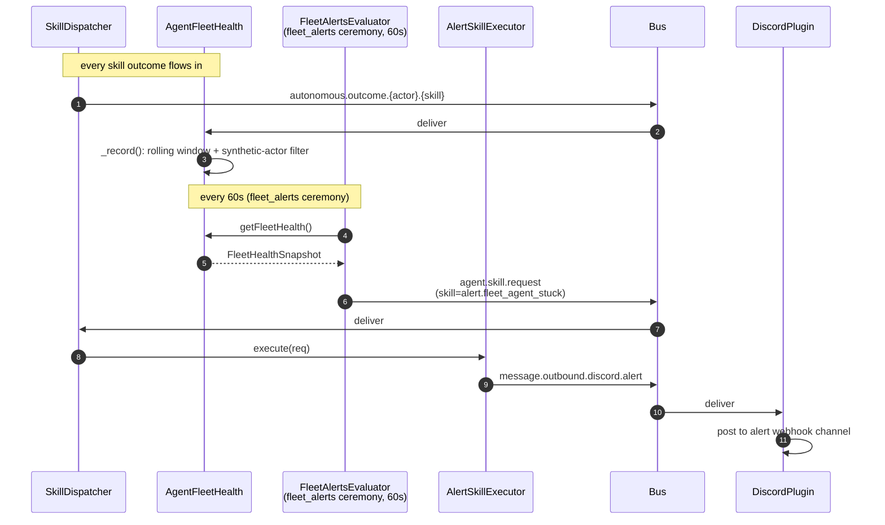
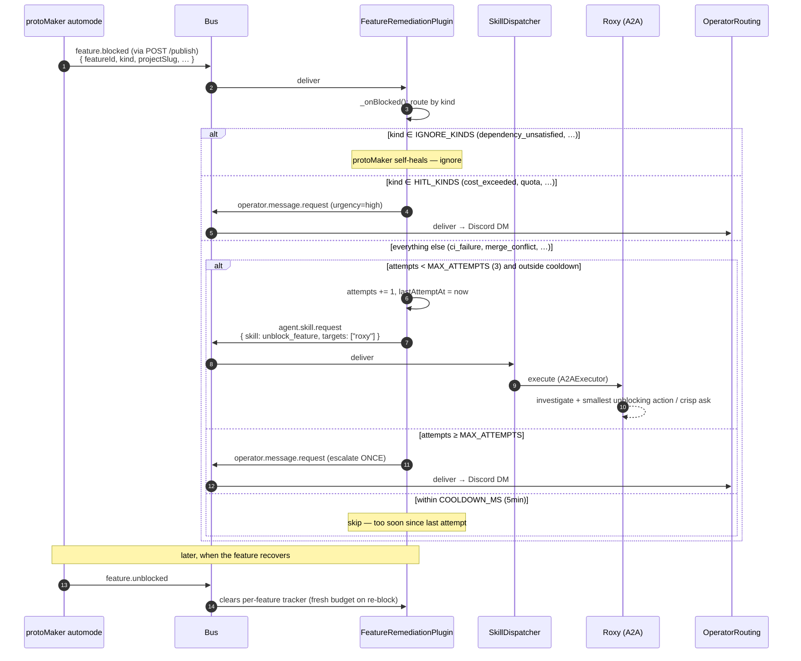

_The fleet self-healing path has two halves. **Alerts**: AgentFleetHealth aggregates outcomes into a snapshot; the `fleet_alerts` ceremony polls thresholds every minute and dispatches `alert.*` skills on violation. **Feature remediation**: protoMaker detects blocked features and emits a kinded `feature.blocked` event; `FeatureRemediationPlugin` routes it (ignore / HITL / Roxy `unblock_feature`) with bounded retries._

> **Note on filename.** This doc was historically "alert / PR remediator." The PR-remediator half is gone — `pr-remediator.ts` was deleted (#776) and replaced by `FeatureRemediationPlugin`, which consumes a single canonical `feature.blocked` signal from protoMaker instead of re-deriving PR-pipeline violations in workstacean. The filename is kept stable to avoid breaking links.

---

## What & why

The fleet is a distributed system; agents fail, features get stuck, costs spike. Two related paths handle the response:

- **Alerts** — declarative skill executors (20 of them) that turn an `alert.fleet_*` skill dispatch into a Discord message. Fire-and-forget, no LLM.
- **Feature remediation** — a single auto-remediation loop. protoMaker's automode raises `feature.blocked` (via the workstacean `/publish` ingress) whenever a feature transitions to blocked, carrying a `kind`. `FeatureRemediationPlugin` routes by kind: ignore the kinds protoMaker self-heals, escalate the kinds no auto-action can fix straight to HITL, and dispatch Roxy's `unblock_feature` for everything else.

Alerts are `FunctionExecutor`-backed (no LLM at the executor). Feature remediation does no work itself — it routes a kinded event to either an operator DM or a Roxy DeepAgent skill that holds the LLM.

---

## ASCII spine

```
   autonomous.outcome.# (from every skill execution)
        │
        ▼
   ┌──────────────────────────┐
   │ AgentFleetHealthPlugin   │  rolling 24h windows
   │   _record()              │  synthetic actor filter (#459)
   │                          │
   │   computes:              │
   │   • successRate          │
   │   • failureRate1h        │
   │   • p50/p95 latency      │
   │   • cost per outcome     │
   │   • orphanedSkillCount   │
   │   • maxFailureRate1h     │
   └──────────────┬───────────┘
                  │ exposed via getFleetHealth() collector
                  ▼  (called by FleetAlertsEvaluatorPlugin)
   ┌──────────────────────────┐
   │ fleet_alerts ceremony     │
   │   (evaluate_fleet_        │
   │    thresholds, every 60s) │
   │   trips thresholds →      │
   │   agent.skill.request     │
   └──────────────┬───────────┘
                  │
                  ▼
   ┌──────────────────────────┐
   │ alert.fleet_agent_stuck  │
   │ alert.fleet_skill_       │
   │   orphaned               │
   │ alert.fleet_cost_over_   │
   │   budget                 │
   │ … (20 alert skills)      │
   └──────────────┬───────────┘
                  │
                  ▼  SkillDispatcher
   ┌──────────────────────────┐
   │ AlertSkillExecutorPlugin │
   │  → message.outbound.     │
   │      discord.alert       │
   └──────────────────────────┘


   protoMaker automode (feature blocked)
        │  POST /publish
        ▼
   ┌──────────────────────────┐
   │ feature.blocked          │  { featureId, kind, projectSlug,
   │   (kinded)               │    prNumber?, reason?, … }
   └──────────────┬───────────┘
                  ▼
   ┌──────────────────────────┐
   │ FeatureRemediationPlugin │  per-feature tracker
   │   _onBlocked()           │  (attempts, cooldown, escalated)
   │                          │
   │   route by kind:         │
   │   • IGNORE_KINDS  ─► drop (protoMaker self-heals)
   │   • HITL_KINDS    ─► operator.message.request
   │   • else          ─► dispatch Roxy unblock_feature
   │                       (bounded: ≤3 attempts, 5min cooldown)
   │                       on exhaustion ─► escalate ONCE to operator
   └──────────────┬───────────┘
                  │
        ┌─────────┴──────────┐
        ▼                    ▼
   agent.skill.request   operator.message.request
   {skill:unblock_feature,   (HITL — see flow-hitl)
    targets:["roxy"]}
        │
        ▼  SkillDispatcher → A2AExecutor (Roxy)

   feature.unblocked ─► clears the per-feature tracker (fresh budget)
```

---

## Sequence (alert path)



## Sequence (feature remediation path)



---

## Bus topic table

### Fleet health

| Topic | Published by | Subscribed by | File:line |
|---|---|---|---|
| `autonomous.outcome.#` | SkillDispatcher | AgentFleetHealthPlugin | `src/plugins/agent-fleet-health-plugin.ts:159` |

### Alerts (20 skills total — sample)

| Skill (on `agent.skill.request`) | Severity | Outbound topic |
|---|---|---|
| `alert.fleet_agent_stuck` | high | `message.outbound.discord.alert` |
| `alert.fleet_skill_orphaned` | medium | `message.outbound.discord.alert` |
| `alert.fleet_cost_over_budget` | high | `message.outbound.discord.alert` |
| … (full list in `ALERT_SKILLS`, [line 39–67](../../src/plugins/alert-skill-executor-plugin.ts)) | | |

All 20 are `FunctionExecutor` registrations with priority=5, fire-and-forget, no LLM.

### Feature remediation

| Topic | Published by | Subscribed by | File |
|---|---|---|---|
| `feature.blocked` | protoMaker automode (via `POST /publish`) | FeatureRemediationPlugin | `lib/plugins/feature-remediation.ts:80` |
| `feature.unblocked` | protoMaker automode (via `POST /publish`) | FeatureRemediationPlugin | `lib/plugins/feature-remediation.ts:82` |
| `agent.skill.request` (`skill: unblock_feature`, `targets: ["roxy"]`) | FeatureRemediationPlugin | SkillDispatcher → Roxy A2AExecutor | `lib/plugins/feature-remediation.ts:150` |
| `operator.message.request` | FeatureRemediationPlugin (HITL_KINDS + exhaustion) | OperatorRoutingPlugin | `lib/plugins/feature-remediation.ts:185` |

`feature.blocked` payload (`FeatureBlockedPayload`): `{ featureId, projectSlug?, projectPath?, featureTitle?, kind?, reason?, prNumber?, branchName?, retryCount?, retryable?, failureCategory?, detail? }`. `featureId` is required; `kind` drives the routing.

---

## Synthetic actor filter (#459)

Lives at [AgentFleetHealthPlugin._record:281–334](../../src/plugins/agent-fleet-health-plugin.ts). Detail in [chokepoint-invariants](chokepoint-invariants.md).

Summary: synthetic actors like `feature-remediation`, `user` are recognized and their outcomes go into the `systemActors[]` bucket (not `agents[]`) so they don't inflate `agentCount` or skew `maxFailureRate1h`.

---

## Threshold evaluation (via fleet_alerts ceremony)

Resolved by **#621** — the GOAP layer that previously evaluated thresholds was ripped in **#518** (2026-05-23), leaving the 20 `alert.*` skills as orphaned dead code for 3 days. The reconnect uses the existing ceremony spine instead of resurrecting GOAP:

```
workspace/ceremonies/fleet-alerts.yaml
  schedule: * * * * *               every minute
  skill: evaluate_fleet_thresholds

src/plugins/fleet-alerts-evaluator-plugin.ts
  registers evaluate_fleet_thresholds (FunctionExecutor)

  on dispatch (every minute):
    1. snapshot = AgentFleetHealthPlugin.getFleetHealth()
    2. for each tripped threshold:
         bus.publish("agent.skill.request", { skill: "alert.X", meta: { metric, value, threshold } })
    3. per-alert cooldown (15min default) suppresses repeats
```

**Three thresholds wired today** (env-overridable):

| Alert | Trigger | Default | Env |
|---|---|---|---|
| `alert.fleet_agent_stuck` | `maxFailureRate1h > 0.5` | 50% | `WORKSTACEAN_FLEET_FAILURE_RATE_THRESHOLD` |
| `alert.fleet_cost_over_budget` | `totalCostUsd1d > $50` | $50/day | `WORKSTACEAN_FLEET_DAILY_BUDGET_USD` |
| `alert.fleet_skill_orphaned` | `orphanedSkillCount > 0` | 0 | (fixed) |

**The other 17 alert skills** remain unwired — they need data sources outside fleet-health (GitHub branch protection, CI failure history, security state). Same state as before #621; surfacing as known work, not regression.

---

## Feature-remediation state machine

`FeatureRemediationPlugin` (`lib/plugins/feature-remediation.ts`) maintains an in-memory `tracked` Map keyed by `{projectSlug|projectPath}::{featureId}`:

```
Tracked {
  attempts,        // auto-remediations dispatched so far
  lastAttemptAt,   // for cooldown
  lastSeenAt,      // for the TTL sweep
  escalated,       // one-shot HITL flag
}
```

Constants: `MAX_ATTEMPTS = 3`, `COOLDOWN_MS = 5min`, `ENTRY_TTL_MS = 1h` (sweep interval that drops stale trackers).

Routing on `feature.blocked` ([feature-remediation.ts:101](../../lib/plugins/feature-remediation.ts)):

- **`kind` ∈ IGNORE_KINDS** (`dependency_unsatisfied`, `external_dependency_unsatisfied`) → ignored; protoMaker self-heals on stale deps. No tracker entry created.
- **`kind` ∈ HITL_KINDS** (`cost_exceeded`, `runtime_exceeded`, `quota`, `rate_limit`, `worktree_safety`) → escalate directly to the operator (`urgency: high`); no auto-action can help.
- **everything else** (`ci_failure`, `merge_conflict`, `changes_requested`, `retries_exhausted`, unknown):
  - `attempts ≥ MAX_ATTEMPTS (3)` → escalate ONCE to the operator, then stay quiet.
  - within `COOLDOWN_MS (5min)` of the last attempt → skip.
  - otherwise → `attempts += 1`, dispatch Roxy `unblock_feature` with the blocked-feature context (`targets: ["roxy"]`, `systemActor: "feature-remediation"`).
- **`feature.unblocked`** → delete the tracker, so a feature that recovers and later re-blocks gets a fresh budget.
- The escalation is one-shot per tracker (`escalated` flag) — bottlenecks-are-growth: a stuck loop becomes a single HITL signal, never silent infinite retry.

---

## Failure modes & gotchas

- **One escalation per blocked feature** — `Tracked.escalated` is a one-shot flag. Once a feature escalates (either via HITL_KINDS or exhaustion), no further operator DMs fire for it until `feature.unblocked` clears the tracker. Acceptable today; revisit if HITL becomes a queue.
- **Trackers are in-memory** — a restart drops all per-feature attempt counts. A feature blocked across a restart starts fresh at `attempts = 0`. The `ENTRY_TTL_MS` sweep also drops trackers idle for >1h, intentionally granting a fresh budget on a much-later re-block.
- **`feature.blocked` without `featureId` is dropped** ([feature-remediation.ts:103](../../lib/plugins/feature-remediation.ts)) with a `console.warn`. protoMaker must always include it.
- **Alert thresholds are hard-coded in source** — `WINDOW_MS = 24h`, `MAX_RECENT_FAILURES = 10`. No env override. Changing these requires a rebuild.
- **Cost calculation depends on `MODEL_RATES`** ([lib/types/budget.ts](../../lib/types/budget.ts)) — hard-coded model price table. When LiteLLM gateway adds a new model, this table must be updated or `costUsd` is zero for that model.
- **Outcome attribution is write-time, not read-time** ([line 281](../../src/plugins/agent-fleet-health-plugin.ts)) — `systemActor` is bucketed *as outcomes arrive*. If `ExecutorRegistry` enrolls a new agent later, prior outcomes for that name stay in `systemActors[]`. Restart required to re-bucket.

---

## Related

- [chokepoint-invariants](chokepoint-invariants.md) — #459 synthetic actor filter
- [flow-hitl](flow-hitl.md) — the escalation path (feature-remediation + dispatch-drop-escalator)
- [flow-agent-runtime-telemetry](flow-agent-runtime-telemetry.md) — what feeds the snapshot
- [flow-dashboard](flow-dashboard.md) — how the snapshot is rendered
