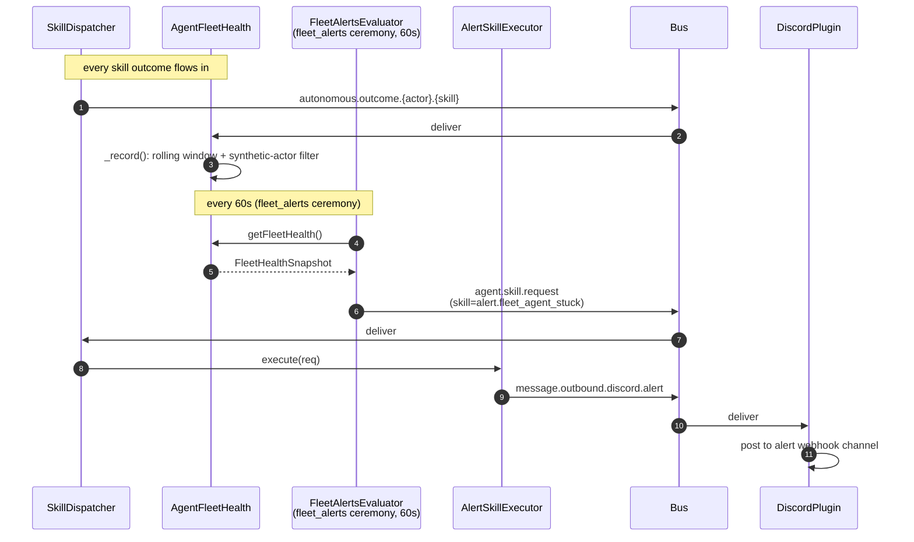

_The fleet self-healing path: AgentFleetHealth aggregates outcomes into a snapshot; the `fleet_alerts` ceremony polls thresholds every minute and dispatches `alert.*` skills on violation. Fire-and-forget, no LLM._

> **Note on filename.** This doc was historically "alert / PR remediator," then "alerts & remediation." Both remediation halves are gone — `pr-remediator.ts` was deleted (#776), and the board-driven auto-remediation loop was removed when the board service was decommissioned. What remains is the fleet-alerts path. The filename is kept stable to avoid breaking links.

---

## What & why

The fleet is a distributed system; agents fail, costs spike. The alerts path handles the response:

- **Alerts** — declarative skill executors (20 of them) that turn an `alert.fleet_*` skill dispatch into a Discord message. Fire-and-forget, no LLM.

Alerts are `FunctionExecutor`-backed (no LLM at the executor). AgentFleetHealth aggregates every skill outcome into a rolling snapshot; the `fleet_alerts` ceremony evaluates thresholds against that snapshot every minute and dispatches an `alert.*` skill when one trips.

---

## ASCII spine

```
   autonomous.outcome.# (from every skill execution)
        │
        ▼
   ┌──────────────────────────┐
   │ AgentFleetHealthPlugin   │  rolling 24h windows
   │   _record()              │  synthetic actor filter (#459)
   │                          │
   │   computes:              │
   │   • successRate          │
   │   • failureRate1h        │
   │   • p50/p95 latency      │
   │   • cost per outcome     │
   │   • orphanedSkillCount   │
   │   • maxFailureRate1h     │
   └──────────────┬───────────┘
                  │ exposed via getFleetHealth() collector
                  ▼  (called by FleetAlertsEvaluatorPlugin)
   ┌──────────────────────────┐
   │ fleet_alerts ceremony     │
   │   (evaluate_fleet_        │
   │    thresholds, every 60s) │
   │   trips thresholds →      │
   │   agent.skill.request     │
   └──────────────┬───────────┘
                  │
                  ▼
   ┌──────────────────────────┐
   │ alert.fleet_agent_stuck  │
   │ alert.fleet_skill_       │
   │   orphaned               │
   │ alert.fleet_cost_over_   │
   │   budget                 │
   │ … (20 alert skills)      │
   └──────────────┬───────────┘
                  │
                  ▼  SkillDispatcher
   ┌──────────────────────────┐
   │ AlertSkillExecutorPlugin │
   │  → message.outbound.     │
   │      discord.alert       │
   └──────────────────────────┘
```

---

## Sequence (alert path)



---

## Bus topic table

### Fleet health

| Topic | Published by | Subscribed by | File:line |
|---|---|---|---|
| `autonomous.outcome.#` | SkillDispatcher | AgentFleetHealthPlugin | `src/plugins/agent-fleet-health-plugin.ts:159` |

### Alerts (20 skills total — sample)

| Skill (on `agent.skill.request`) | Severity | Outbound topic |
|---|---|---|
| `alert.fleet_agent_stuck` | high | `message.outbound.discord.alert` |
| `alert.fleet_skill_orphaned` | medium | `message.outbound.discord.alert` |
| `alert.fleet_cost_over_budget` | high | `message.outbound.discord.alert` |
| … (full list in `ALERT_SKILLS`, [line 39–67](../../src/plugins/alert-skill-executor-plugin.ts)) | | |

All 20 are `FunctionExecutor` registrations with priority=5, fire-and-forget, no LLM.

---

## Synthetic actor filter (#459)

Lives at [AgentFleetHealthPlugin._record:281–334](../../src/plugins/agent-fleet-health-plugin.ts). Detail in [chokepoint-invariants](chokepoint-invariants.md).

Summary: synthetic actors like `user` are recognized and their outcomes go into the `systemActors[]` bucket (not `agents[]`) so they don't inflate `agentCount` or skew `maxFailureRate1h`.

---

## Threshold evaluation (via fleet_alerts ceremony)

Resolved by **#621** — the GOAP layer that previously evaluated thresholds was ripped in **#518** (2026-05-23), leaving the 20 `alert.*` skills as orphaned dead code for 3 days. The reconnect uses the existing ceremony spine instead of resurrecting GOAP:

```
workspace/ceremonies/fleet-alerts.yaml
  schedule: * * * * *               every minute
  skill: evaluate_fleet_thresholds

src/plugins/fleet-alerts-evaluator-plugin.ts
  registers evaluate_fleet_thresholds (FunctionExecutor)

  on dispatch (every minute):
    1. snapshot = AgentFleetHealthPlugin.getFleetHealth()
    2. for each tripped threshold:
         bus.publish("agent.skill.request", { skill: "alert.X", meta: { metric, value, threshold } })
    3. per-alert cooldown (15min default) suppresses repeats
```

**Three thresholds wired today** (env-overridable):

| Alert | Trigger | Default | Env |
|---|---|---|---|
| `alert.fleet_agent_stuck` | `maxFailureRate1h > 0.5` | 50% | `WORKSTACEAN_FLEET_FAILURE_RATE_THRESHOLD` |
| `alert.fleet_cost_over_budget` | `totalCostUsd1d > $50` | $50/day | `WORKSTACEAN_FLEET_DAILY_BUDGET_USD` |
| `alert.fleet_skill_orphaned` | `orphanedSkillCount > 0` | 0 | (fixed) |

**The other 17 alert skills** remain unwired — they need data sources outside fleet-health (GitHub branch protection, CI failure history, security state). Same state as before #621; surfacing as known work, not regression.

---

## Failure modes & gotchas

- **Alert thresholds are hard-coded in source** — `WINDOW_MS = 24h`, `MAX_RECENT_FAILURES = 10`. No env override. Changing these requires a rebuild.
- **Cost calculation depends on `MODEL_RATES`** ([lib/types/budget.ts](../../lib/types/budget.ts)) — hard-coded model price table. When LiteLLM gateway adds a new model, this table must be updated or `costUsd` is zero for that model.
- **Outcome attribution is write-time, not read-time** ([line 281](../../src/plugins/agent-fleet-health-plugin.ts)) — `systemActor` is bucketed *as outcomes arrive*. If `ExecutorRegistry` enrolls a new agent later, prior outcomes for that name stay in `systemActors[]`. Restart required to re-bucket.

---

## Related

- [chokepoint-invariants](chokepoint-invariants.md) — #459 synthetic actor filter
- [flow-hitl](flow-hitl.md) — the operator escalation path (dispatch-drop-escalator)
- [flow-agent-runtime-telemetry](flow-agent-runtime-telemetry.md) — what feeds the snapshot
- [flow-dashboard](flow-dashboard.md) — how the snapshot is rendered
