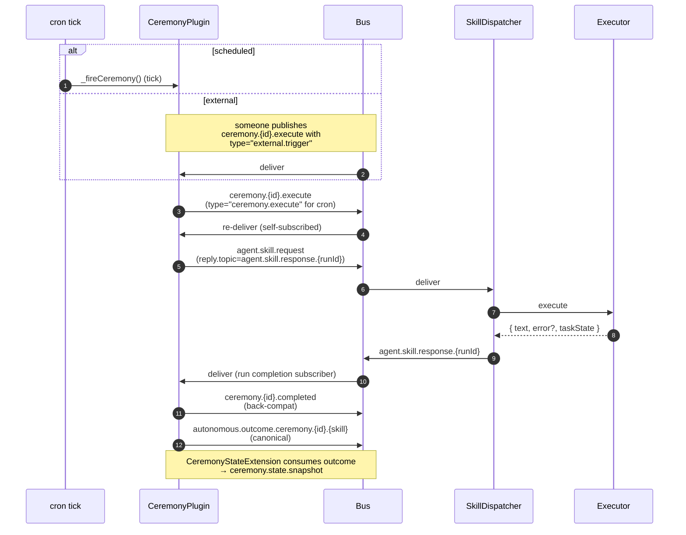

_Cron-triggered fleet rituals: a YAML declaration says "every 3 hours, run skill X on target Y", CeremonyPlugin fires `ceremony.{id}.execute`, dispatches `agent.skill.request`, persists outcome. Same shape as inbound flow but with declarative scheduling instead of webhook entry._

---

## What & why

Some fleet work doesn't have a natural webhook trigger — sweeping a board for stale issues, posting a daily summary, running security checks. Ceremonies declare these as YAML, the plugin schedules them, and the result enters the same dispatcher chokepoint as a chat message would. On-demand triggering also works (publish `ceremony.{id}.execute` directly).

Ceremonies are **scheduled fleet rituals**, not orchestrated multi-step workflows. There is no DAG, no retry policy, no branching logic at the ceremony level — that's a skill's responsibility.

---

## ASCII spine

```
   workspace/ceremonies/*.yaml          .proto/projects/{slug}/ceremonies/
        ┌────┴───────────────────────────┴────┐
        │  ceremonyYamlLoader (5s hot-reload) │
        │  merge: project overrides global    │
        └─────────────────┬───────────────────┘
                          │
                          ▼
   ┌──────────────────────────┐
   │  CeremonyPlugin          │
   │   _scheduleCeremony()    │  ← cron-expression-parser
   │                          │
   │   subscribes to:         │  on tick → _fireCeremony()
   │     ceremony.{id}.execute│  on external publish → _fireCeremony()
   └──────────────┬───────────┘
                  │
                  ▼
   ┌──────────────────────────┐
   │  ceremony.{id}.execute   │  payload.type ∈ {"ceremony.execute", "external.trigger"}
   └──────────────┬───────────┘
                  │  (plugin re-subscribes to its own published topic)
                  ▼
   ┌──────────────────────────┐
   │  _dispatchSkillAndCompl. │
   │                          │
   │  publishes agent.skill.  │ → SkillDispatcher → executor
   │  request                 │
   │                          │
   │  subscribes to           │ ← waits for executor response
   │  agent.skill.response.   │
   │  {runId}                 │
   └──────────────┬───────────┘
                  │
        ┌─────────┴─────────┐
        ▼                   ▼
   ┌──────────────┐  ┌──────────────────────┐
   │ ceremony.{id}│  │ autonomous.outcome.  │
   │ .completed   │  │ ceremony.{id}.{skill}│   ← canonical
   │ (back-compat)│  │                      │
   └──────────────┘  └──────────────────────┘
```

---

## YAML schema

[CeremonyPlugin.types.ts:8–25](../../src/plugins/CeremonyPlugin.types.ts):

```yaml
id: security-sweep                # required, unique
name: Security Sweep              # required, human label
schedule: "0 */3 * * *"           # required, cron expression
skill: security_triage            # required, what to dispatch
targets: ["quinn"]                # required, executor target(s)
notifyChannel: 1234567890         # optional, Discord channel for summary
enabled: true                     # optional, default true
timeoutMs: 600000                 # optional, no timeout if absent
```

**Locations searched** ([CeremonyPlugin.ts:104,107](../../src/plugins/CeremonyPlugin.ts)):
1. `workspace/ceremonies/*.yaml` — global
2. `.proto/projects/{slug}/ceremonies/*.yaml` — per-project overrides

Merge: project overrides global by `id`.

**Hot-reload:** 5s file watcher (`HOT_RELOAD_INTERVAL_MS = 5000`).

---

## Sequence



---

## Bus topic table

| Topic | Published by | Subscribed by | File:line |
|---|---|---|---|
| `ceremony.{id}.execute` | CeremonyPlugin (cron) / CeremonySkillExecutorPlugin (external) | CeremonyPlugin (self) | `src/plugins/CeremonyPlugin.ts:344` |
| `agent.skill.request` | CeremonyPlugin._dispatchSkillAndComplete | SkillDispatcher | `src/plugins/CeremonyPlugin.ts:394` |
| `agent.skill.response.{runId}` | SkillDispatcher | CeremonyPlugin | `src/plugins/CeremonyPlugin.ts:372` |
| `ceremony.{id}.completed` | CeremonyPlugin | (back-compat consumers) | `src/plugins/CeremonyPlugin.ts:448` |
| `autonomous.outcome.ceremony.{id}.{skill}` | CeremonyPlugin | AgentFleetHealth, CeremonyStateExtension | `src/plugins/CeremonyPlugin.ts:439` |
| `ceremony.state.snapshot` | CeremonyStateExtension | world-state aggregator | extension header docstring |

---

## On-demand triggering

External publishes to `ceremony.{id}.execute` with `payload.type = "external.trigger"` fire the same path as cron. This is how chat commands like "/ceremony run security-sweep" work — they don't bypass cron, they participate as another publisher.

**Why two payload types:** when the cron path also publishes on the same topic, the self-subscription would fire twice. `payload.type` lets the handler distinguish self-triggered (drop) from externally-triggered (run) without breaking the self-subscription contract.

---

## Executor mapping

[CeremonySkillExecutorPlugin.ts:40–55](../../src/plugins/CeremonySkillExecutorPlugin.ts) maintains an explicit `CEREMONY_SKILLS` table:

```
ceremony.security_triage  →  ceremonyId: security-sweep
ceremony.…                →  ceremonyId: …
```

Each entry registers a `FunctionExecutor` with `ExecutorRegistry` (priority=5) that publishes `ceremony.{ceremonyId}.execute` when its skill is dispatched. This is how a *skill name* on `agent.skill.request` becomes a *ceremony trigger* on `ceremony.{id}.execute`.

The skill→ceremonyId mapping is explicit (not derived) so renames don't silently break dispatches.

---

## Failure modes & gotchas

- **Disabled ceremonies are unregistered from ExecutorRegistry** ([line 263–268](../../src/plugins/CeremonyPlugin.ts)) — external triggers cannot fire a disabled ceremony, even though the YAML still parses. Re-enabling requires the next hot-reload tick.
- **`timeoutMs` is per-ceremony** ([line 386](../../src/plugins/CeremonyPlugin.ts)) — if unset, no timeout. The dispatcher itself has no timeout (see [chokepoint-invariants](chokepoint-invariants.md)). For long ceremonies, set `timeoutMs` explicitly or the run can hang.
- **Project overrides global** ([ceremonyYamlLoader.ts:60–66](../../src/plugins/ceremonyYamlLoader.ts)) — if both define `id: x`, project wins. This is intentional but can confuse if you forgot a project-level file existed.
- **Cron format is parser-dependent** ([CeremonyPlugin.ts:285](../../src/plugins/CeremonyPlugin.ts)) — uses `cron-expression-parser`. Standard 5-field cron (`* * * * *`); no 6-field (seconds) support.
- **The `ceremony.{id}.completed` topic is back-compat only** — new consumers should subscribe to `autonomous.outcome.ceremony.{id}.{skill}` which is the canonical telemetry path and matches the fleet-health attribution model.

---

## Related

- [flow-inbound-message](flow-inbound-message.md) — what `agent.skill.request` does next
- [flow-agent-runtime-telemetry](flow-agent-runtime-telemetry.md) — what `autonomous.outcome.*` feeds
- [flow-alert-remediator](flow-alert-remediator.md) — alerts are also FunctionExecutor-backed and share the same dispatch pattern
