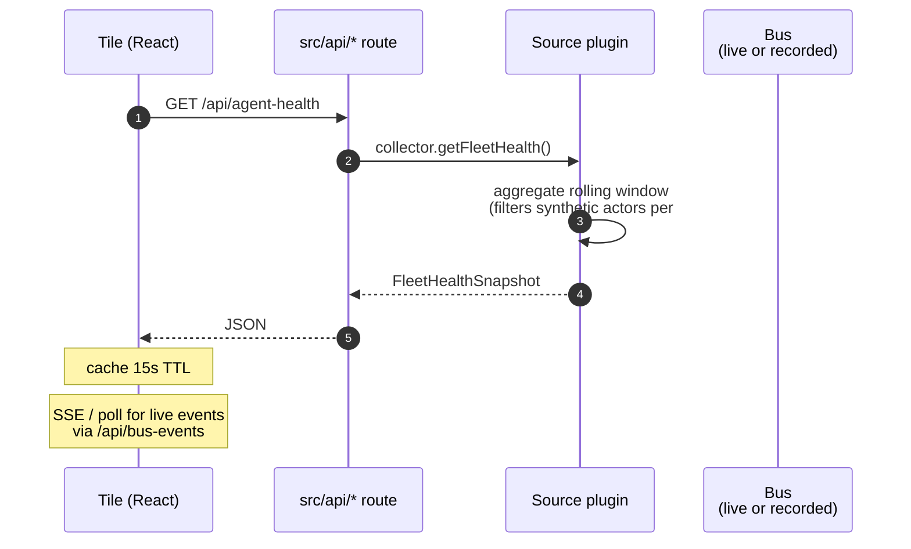

_The dashboard is a separate Vite + React 19 frontend at `http://ava:3333` (Tailscale-only). Almost all of it **reads** from API routes that aggregate live bus events plus rolling-window snapshots. The one **write** surface is the Console (ADR-0004 P3), which mutates the fleet through the admin-gated control-plane API — never by touching the bus directly._

---

## What & why

Operators need a single pane to see "what is the fleet doing right now" without tailing logs — and, increasingly, to *change* the fleet without editing YAML on the host and redeploying. The dashboard splits cleanly into two halves.

### Read side (debug panes) — the majority

Intentionally **read-only** and **debug-oriented**. The bus → API → tile chain is one-way; these panes never write. Three classes of data feed them:

- **Live bus events** via `BusHistoryRecorder` → API → SSE/poll → tile
- **Rolling-window snapshots** computed in plugins (`AgentFleetHealth`, `CostStore`) → API JSON → tile
- **External state** (GitHub PR pipeline, Linear) via per-plugin APIs

### Write side (the Console) — ADR-0004 P3

A single surface that mutates the control plane: create/edit/remove in-process DeepAgents, probe + register/remove remote A2A agents. It is **admin-key gated** (`X-API-Key`) and never publishes to the bus from the browser. Every mutation is an HTTP call to the control-plane API, which validates, publishes a `command.*` topic, and lets the sole `ControlPlaneRegistrar` perform the atomic filesystem write — the change then applies live via hot-reload (~5s). See [the read/write split](#read-write-split) below.

> The split is structural, not cosmetic: read panes call cached `apiFetch` GETs with no key; the Console calls uncached `adminFetch` mutations with the admin key. A read pane cannot accidentally mutate, and the Console cannot serve a stale fleet from cache.

---

## ASCII spine

```
                     Bus events                  External APIs
                          │                            │
              ┌───────────┴────────┐                   │
              ▼                    ▼                   ▼
   ┌──────────────────┐  ┌──────────────────┐  ┌────────────────┐
   │ BusHistory       │  │ AgentFleetHealth │  │ GitHubPlugin   │
   │ Recorder         │  │ rolling 24h      │  │ pr-pipeline    │
   │ (in-mem ring)    │  │ window           │  │ snapshot       │
   └────────┬─────────┘  └─────────┬────────┘  └────────┬───────┘
            │                      │                    │
            ▼                      ▼                    ▼
   ┌──────────────────────────────────────────────────────────┐
   │ src/api/  HTTP routes (per-module)                       │
   │                                                          │
   │  /api/bus/history          (BusHistoryRecorder)          │
   │  /api/bus/topology         (bus introspection)           │
   │  /api/bus/subscribe (WS)    (live topic feed)            │
   │  /api/control-plane/state  (fleet + AgentFleetHealth)    │
   │  /api/agents/runtime       (ExecutorRegistry)            │
   │  /api/cost-summaries       (CostStore)                   │
   │  /api/pr-pipeline          (GitHubPlugin)                │
   │  /api/ceremonies           (CeremonyPlugin)              │
   └────────────────────────┬─────────────────────────────────┘
                            │
                            ▼  HTTPS over Tailscale
                            │  (http://ava:3333)
                            ▼
   ┌──────────────────────────────────────────────────────────┐
   │ dashboard/  (Vite + React 19 SPA, react-router)          │
   │                                                          │
   │  routes (src/components/)    fetch via dashboard/src/lib/api.ts │
   │   • /          OverviewGrid                              │
   │   • /system    SystemGraph   (GET + /ws + WS             │
   │   • /trace     SkillTrace      /api/bus/subscribe)       │
   │   • /events    EventStream                               │
   │   • /agents    AgentsView                                │
   │   • /console   Console  ← the WRITE surface (admin key)  │
   │                                                          │
   │  Routes render inside Layout (sidebar + header), each    │
   │  wrapped in an ErrorBoundary — a pane crash is contained │
   │  (sidebar stays, error shown), never a blank screen.     │
   └──────────────────────────────────────────────────────────┘
```

---

## Sequence (a single tile fetch)



---

## API routes table

### Read (debug panes) — cached GETs, no key

| Route | Source | Cache TTL | Tile |
|---|---|---|---|
| `/api/bus/history` | BusHistoryRecorder | live (SSE / poll) | Live event log, D1 dashboard |
| `/api/agents/runtime` | ExecutorRegistry + agents.yaml/agents.d | 30s | Fleet list |
| `/api/control-plane/state` | ExecutorRegistry + AgentFleetHealth | 15s | **Unified** read — fleet + 24h health (Console fleet rows) |
| `/api/cost-summaries` | CostStore | 30s | Fleet cost tile |
| `/api/pr-pipeline` | GitHubPlugin | 30s | PR-1/-2/-3 review pipeline tiles |
| `/api/ceremonies` | CeremonyPlugin | 60s | Ceremony status tile |

`/api/control-plane/state` (ADR-0004 P5b) is the **unified** read: one call returns the live fleet *and* the per-agent 24h health rollup. The health half is served from `AgentFleetHealthPlugin`'s in-memory window, which is **rehydrated from `knowledge.db` on startup** (P5a) — so the numbers survive restarts rather than resetting to zero on every redeploy. Per [dashboard/src/lib/api.ts](../../dashboard/src/lib/api.ts).

### Write (the Console) — uncached, admin-key gated

| Route | Method | Effect |
|---|---|---|
| `/api/agents` | POST | Create an in-process DeepAgent (→ `workspace/agents/<name>.yaml`) |
| `/api/agents/:name` | PUT / DELETE / GET | Update / remove / read one DeepAgent |
| `/api/agents/test` | POST | Validate a definition without persisting |
| `/api/a2a/probe` | POST | Capability discovery — probe a remote agent's card |
| `/api/a2a-endpoints` | POST | Register a remote A2A agent (→ `workspace/agents.d/<name>.yaml`) |
| `/api/a2a-endpoints/:name` | DELETE | Remove a control-plane-managed A2A agent |

Each write validates, publishes a `command.*` topic, and the `ControlPlaneRegistrar` (sole writer) performs the atomic file write; hot-reload applies it in ~5s.

---

## <a id="read-write-split"></a>Read / write split

```
  Read pane (no key)                         Console (admin key)
        │ apiFetch GET (cached)                     │ adminFetch POST/PUT/DELETE (uncached)
        ▼                                           ▼
  ┌──────────────────┐                      ┌──────────────────────┐
  │ src/api/* GET     │                      │ src/api/agents-crud   │
  │ routes (read-only)│                      │ + a2a-endpoints       │
  └────────┬─────────┘                      └───────────┬──────────┘
           │ registry / plugin snapshot                 │ validate → publish command.*
           ▼                                             ▼
   (in-memory + knowledge.db)              ControlPlaneRegistrar (sole writer)
                                                         │ atomic temp+rename
                                                         ▼
                                            workspace/agents/ · agents.d/
                                                         │ file-watch
                                                         ▼
                                            hot-reload → live in ~5s
```

The browser never publishes to the bus. The only path from a click to a bus message is HTTP → API route → `command.*` → registrar, so every mutation is auditable in bus-history and confined to one writer.

---

## BusHistoryRecorder

[src/event-bus/bus-history-recorder.ts](../../src/event-bus/bus-history-recorder.ts) subscribes broadly to `agent.skill.*`, `flow.item.*`, `autonomous.outcome.*`, `ceremony.*`, and `message.inbound.*` / `message.outbound.*` (selectively). Keeps a bounded in-memory ring of recent events. Exposed via `/api/bus-events` for the live event log and dashboard inspector.

**State:** in-memory. Restart wipes history. **There is no durable persistence** — the dashboard is a snapshot of *current process*, not a historical archive.

**Bus topics observed (selection):**

| Pattern | Used for |
|---|---|
| `agent.skill.request` | "what just dispatched" |
| `agent.skill.response.#` | response payloads (text preview) |
| `flow.item.#` | PR-1/-2/-3 lifecycle tiles |
| `autonomous.outcome.#` | outcomes feed |
| `autonomous.cost.#` | cost feed |
| `ceremony.#.completed` | ceremony status |

---

## Route inventory (current SPA)

| Route | Component | Data source |
|---|---|---|
| `/` | `OverviewGrid` | `/api/agents/runtime`, `/api/ci-health`, `/api/pr-pipeline`, `/api/security-summary`, `/api/hitl/pending` |
| `/system` | `SystemGraph` | `/api/bus/topology` + `/api/agents/runtime` (graph) · `/api/bus/subscribe?topic=#` (live edge pulses) · overlays `QuinnVerdictCounters` + `LatencyHistogram` (each their own `/api/bus/subscribe` WS) |
| `/trace` | `SkillTrace` | `/api/bus/history` (D1 skill-trace) |
| `/events` | `EventStream` | `/ws` (live bus feed) |
| `/agents` | `AgentsView` | `/api/agents/runtime`, `/api/ceremonies` |
| `/console` | `Console` | `/api/control-plane/state` (read) + admin write API (the one write surface) |

Header live/disconnected indicator: its own `/ws` connection in `Layout`.

> **WS caveat (`:8081` vs direct):** the live-update sockets (`/api/bus/subscribe`, `/ws`) are served by the **main server**. The event-viewer proxy (`:8081`) upgrades `/ws` itself but does **not** proxy `/api/bus/subscribe` — so when the dashboard is loaded via `:8081`, the `/system` live-edge pulses + the latency/verdict overlays get no live data (the views still render; they retry silently). Serve the dashboard from the main-server origin for full live WS, or teach the event-viewer to proxy `/api/bus/subscribe`. (tracked follow-up)

---

## Tailscale-only deployment

The dashboard is **never internet-exposed**:

- Bound to `0.0.0.0:3333` inside the container
- Tailscale serve maps to `http://ava:3333` (MagicDNS)
- `ava.proto-labs.ai` (public) uses a Caddyfile + cloudflared allowlist that **excludes** `/dashboard` and `/system` paths

This means dashboard data — including PR contents, agent token usage, internal channel IDs — never leaves the tailnet.

---

## Failure modes & gotchas

- **Bus-event history is in-memory only** — restart wipes the live event log. No "what happened last night while I was asleep" view without external logging. (Fleet *health*, by contrast, is durable as of ADR-0004 P5a — the 24h outcome window rehydrates from `knowledge.db` on startup, so success-rate / cost numbers survive a redeploy even though the raw event stream doesn't.)
- **Aspirational topics show empty tiles** — anything depending on `agent.runtime.activity.tool.call` or `agent.skill.latency` is empty (see [flow-agent-runtime-telemetry](flow-agent-runtime-telemetry.md)).
- **Cost can be zero for new models** — `MODEL_RATES` table is hard-coded; LiteLLM adding a model = zero cost recorded until updated.
- **PR-pipeline tile depends on GitHubPlugin's local cache** — `pr_pipeline` snapshot is built on-demand by hitting GitHub API. Heavy refresh load if many tiles open simultaneously.
- **Synthetic actors don't show in agent grid** — by design ([#459 chokepoint](chokepoint-invariants.md)) — they appear in a separate "system actors" panel on the fleet-health page, not under "agents".

---

## Related

- [flow-inbound-message](flow-inbound-message.md) — source of most bus events the dashboard shows
- [flow-agent-runtime-telemetry](flow-agent-runtime-telemetry.md) — direct upstream
- [flow-alert-remediator](flow-alert-remediator.md) — feeds the fleet health tile
- [flow-pr-review](flow-pr-review.md) — feeds the PR-1/-2/-3 tiles
