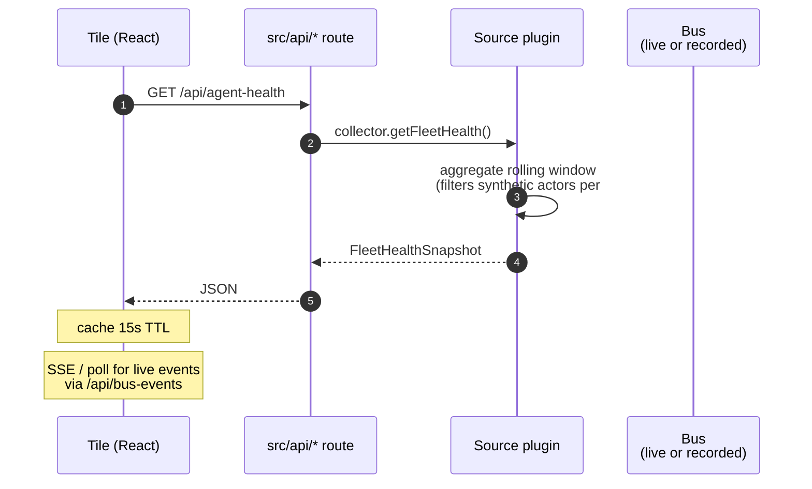

_The dashboard is a separate Vite + React 19 frontend at `http://ava:3333` (Tailscale-only). It reads from API routes that aggregate live bus events plus rolling-window snapshots. The bus → API → tile chain is one-way; the dashboard does not write to the bus._

---

## What & why

Operators need a single pane to see "what is the fleet doing right now" without tailing logs. The dashboard is intentionally **read-only** and **debug-oriented** — not a control surface. (Memory: "we dont really want to use this as a ui anyhow, more for debugging".)

Three classes of data feed the tiles:

- **Live bus events** via `BusHistoryRecorder` → API → SSE/poll → tile
- **Rolling-window snapshots** computed in plugins (`AgentFleetHealth`, `CostStore`) → API JSON → tile
- **External state** (GitHub PR pipeline, Linear) via per-plugin APIs

---

## ASCII spine

```
                     Bus events                  External APIs
                          │                            │
              ┌───────────┴────────┐                   │
              ▼                    ▼                   ▼
   ┌──────────────────┐  ┌──────────────────┐  ┌────────────────┐
   │ BusHistory       │  │ AgentFleetHealth │  │ GitHubPlugin   │
   │ Recorder         │  │ rolling 24h      │  │ pr-pipeline    │
   │ (in-mem ring)    │  │ window           │  │ snapshot       │
   └────────┬─────────┘  └─────────┬────────┘  └────────┬───────┘
            │                      │                    │
            ▼                      ▼                    ▼
   ┌──────────────────────────────────────────────────────────┐
   │ src/api/  HTTP routes (per-module)                       │
   │                                                          │
   │  /api/bus-events       (BusHistoryRecorder)              │
   │  /api/agent-health     (AgentFleetHealth)                │
   │  /api/outcomes         (AgentFleetHealth)                │
   │  /api/cost-summaries   (CostStore)                       │
   │  /api/pr-pipeline      (GitHubPlugin)                    │
   │  /api/ceremonies       (CeremonyPlugin)                  │
   │  /api/a2a-status       (SkillBrokerPlugin)               │
   └────────────────────────┬─────────────────────────────────┘
                            │
                            ▼  HTTPS over Tailscale
                            │  (http://ava:3333)
                            ▼
   ┌──────────────────────────────────────────────────────────┐
   │ dashboard/  (Vite + React 19)                            │
   │                                                          │
   │  pages/                    fetch via:                    │
   │   • system.astro             dashboard/src/lib/api.ts    │
   │   • agents.astro             TTL: 15s fleet health       │
   │   • outcomes.astro                  30s cost             │
   │   • fleet-cost.astro                live SSE for events  │
   │   • pr-pipeline.astro                                    │
   │   • ceremonies.astro                                     │
   └──────────────────────────────────────────────────────────┘
```

---

## Sequence (a single tile fetch)



---

## API routes table

| Route | Source plugin | Cache TTL | Tile |
|---|---|---|---|
| `/api/bus-events` | BusHistoryRecorder | live (SSE / 1s poll) | Live event log, D1 dashboard |
| `/api/agent-health` | AgentFleetHealth | 15s | Agents tile, agent rows |
| `/api/outcomes` | AgentFleetHealth | 15s | Outcomes tile, D2/D3 dashboards |
| `/api/cost-summaries` | CostStore | 30s | Fleet cost tile |
| `/api/pr-pipeline` | GitHubPlugin | 30s | PR-1/-2/-3 review pipeline tiles |
| `/api/ceremonies` | CeremonyPlugin | 30s | Ceremony status tile |
| `/api/a2a-status` | SkillBrokerPlugin | 60s | A2A health tile |

Per [dashboard/src/lib/api.ts:85–95](../../dashboard/src/lib/api.ts).

---

## BusHistoryRecorder

[src/event-bus/bus-history-recorder.ts](../../src/event-bus/bus-history-recorder.ts) subscribes broadly to `agent.skill.*`, `flow.item.*`, `autonomous.outcome.*`, `ceremony.*`, and `message.inbound.*` / `message.outbound.*` (selectively). Keeps a bounded in-memory ring of recent events. Exposed via `/api/bus-events` for the live event log and dashboard inspector.

**State:** in-memory. Restart wipes history. **There is no durable persistence** — the dashboard is a snapshot of *current process*, not a historical archive.

**Bus topics observed (selection):**

| Pattern | Used for |
|---|---|
| `agent.skill.request` | "what just dispatched" |
| `agent.skill.response.#` | response payloads (text preview) |
| `flow.item.#` | PR-1/-2/-3 lifecycle tiles |
| `autonomous.outcome.#` | outcomes feed |
| `autonomous.cost.#` | cost feed |
| `ceremony.#.completed` | ceremony status |

---

## Tile inventory (current)

| Tile | Page | Data source |
|---|---|---|
| Live event log | `system.astro` | `/api/bus-events` (SSE) |
| Agent grid | `agents.astro` | `/api/agent-health` |
| Outcomes by skill | `outcomes.astro` | `/api/outcomes` |
| Fleet cost / token usage | `fleet-cost.astro` | `/api/cost-summaries` |
| PR review pipeline (PR-1/-2/-3) | `pr-pipeline.astro` | `/api/pr-pipeline` + `flow.item.*` |
| Ceremony status | `ceremonies.astro` | `/api/ceremonies` |
| Architectural-column overlay | `system.astro` | static layout + live agent positions |

D1/D2/D3 (dashboard sub-pages) and O-2/-3/-4 (corner overlay tiles) are sub-views of the above sources, not independent data paths.

---

## Tailscale-only deployment

The dashboard is **never internet-exposed**:

- Bound to `0.0.0.0:3333` inside the container
- Tailscale serve maps to `http://ava:3333` (MagicDNS)
- `ava.proto-labs.ai` (public) uses a Caddyfile + cloudflared allowlist that **excludes** `/dashboard` and `/system` paths

This means dashboard data — including PR contents, agent token usage, internal channel IDs — never leaves the tailnet.

---

## Failure modes & gotchas

- **History is in-memory only** — restart wipes the event log. No "what happened last night while I was asleep" view without external logging.
- **Aspirational topics show empty tiles** — anything depending on `agent.runtime.activity.tool.call` or `agent.skill.latency` is empty (see [flow-agent-runtime-telemetry](flow-agent-runtime-telemetry.md)).
- **Cost can be zero for new models** — `MODEL_RATES` table is hard-coded; LiteLLM adding a model = zero cost recorded until updated.
- **PR-pipeline tile depends on GitHubPlugin's local cache** — `pr_pipeline` snapshot is built on-demand by hitting GitHub API. Heavy refresh load if many tiles open simultaneously.
- **Synthetic actors don't show in agent grid** — by design ([#459 chokepoint](chokepoint-invariants.md)) — they appear in a separate "system actors" panel on the fleet-health page, not under "agents".

---

## Related

- [flow-inbound-message](flow-inbound-message.md) — source of most bus events the dashboard shows
- [flow-agent-runtime-telemetry](flow-agent-runtime-telemetry.md) — direct upstream
- [flow-alert-remediator](flow-alert-remediator.md) — feeds the fleet health tile
- [flow-pr-review](flow-pr-review.md) — feeds the PR-1/-2/-3 tiles
