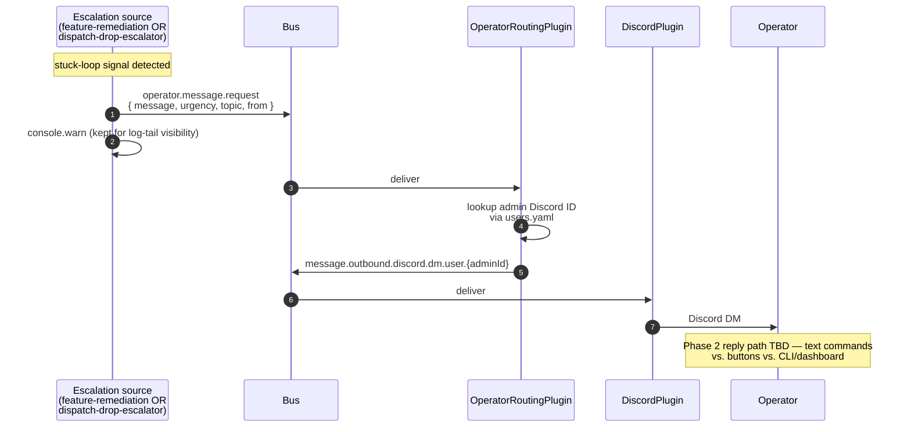

_When an autonomous loop gets stuck, escalation sites publish `operator.message.request` which `OperatorRoutingPlugin` routes to a Discord DM. **Phase 1 outbound is shipped** (#622, #776); the operator-reply path back into the bus (Phase 2) is still open design — text commands vs. buttons vs. CLI/dashboard, decision pending real usage data._

---

## What & why

Bottlenecks are growth signals. A stuck autonomous loop should **escalate, not silently drop** — each escalation is a feature-request for the next layer of autonomy. HITL is the structural place to surface those.

Two production-wired escalation sources today, both pushing to the same `operator.message.request` topic:

| Source | What it escalates | Source | Shipped in |
|---|---|---|---|
| **feature-remediation** | Blocked features — directly for HITL_KINDS (cost / runtime / quota / rate-limit / worktree-safety) and once on auto-remediation exhaustion (≥3 Roxy `unblock_feature` attempts) | `lib/plugins/feature-remediation.ts:_escalate` | #776 |
| **dispatch-drop-escalator** | Drop storms (N drops on same key in M min — cooldown trips, target-unresolved, no-skill) | `src/plugins/dispatch-drop-escalator-plugin.ts` | #622 |
| **Operator routing** | Subscriber that takes any `operator.message.request` and routes to the admin Discord DM via `users.yaml` identity | `lib/plugins/operator-routing.ts` | pre-existing |

The previous `lib/plugins/hitl.ts` was ripped in commit `f658744` (2026-05-23) because it violated bus-is-the-contract — DiscordPlugin held a direct reference to `hitlPlugin.registerRenderer()`. The rip commit explicitly anticipated this reconnect: "If approval gates are needed later they'll be implemented as pure bus pub/sub with no registrar pattern." Phase 1 honors that — both feature-remediation and dispatch-drop-escalator are pure publish-only.

---

## ASCII spine

```
   blocked feature              drop storm (N drops in M min)    [future sources]
   (HITL kind, or                    │                              │
    ≥3 Roxy attempts)                │                              │
        │                           │                              │
        ▼                           ▼                              ▼
   ┌──────────────┐         ┌────────────────────┐
   │ feature-     │         │ dispatch-drop-     │
   │ remediation  │         │ escalator          │
   │              │         │                    │
   │ #776         │         │ #622               │
   └─────┬────────┘         └─────────┬──────────┘
         │                            │
         └──────────────┬─────────────┘
                        ▼
   ┌──────────────────────────┐
   │  operator.message.       │  topic shape OperatorMessageRequest
   │  request                 │  { message, urgency, topic, from }
   └──────────────┬───────────┘
                  ▼
   ┌──────────────────────────┐
   │  OperatorRoutingPlugin   │  reads workspace/users.yaml
   │   resolves operator      │  routes to:
   │   userId                 │
   └──────────────┬───────────┘
                  ▼
   ┌──────────────────────────┐
   │  message.outbound.       │
   │  discord.dm.user.{userId}│
   └──────────────┬───────────┘
                  ▼
            Operator's Discord DM
                  │
                  ▼  (response path not implemented today)
            ⚠ no inbound subscriber for operator reply
```

---

## Sequence



---

## Bus topic table

| Topic | Publisher(s) | Subscriber | Status |
|---|---|---|---|
| `operator.message.request` | feature-remediation (#776), dispatch-drop-escalator (#622) | OperatorRoutingPlugin | ✅ wired |
| `operator.message.failed.{correlationId}` | OperatorRoutingPlugin (when no transport available) | _(no subscriber yet — for future HTTP callers)_ | ✅ wired publisher side |
| `message.outbound.discord.dm.user.{userId}` | OperatorRoutingPlugin | DiscordPlugin DM sink | ✅ wired |
| `operator.message.response` | _Phase 2 — not yet implemented_ | _Phase 2 — an escalation source would consume_ | ❌ aspirational |

---

## Escalation trigger sites (today)

All sites publish `operator.message.request` AND keep their `console.warn` (log-tail visibility is independent of the bus path).

### feature-remediation ([feature-remediation.ts](../../lib/plugins/feature-remediation.ts), all flow through `_escalate`):

| Site | Condition | Urgency |
|---|---|---|
| HITL kind | `kind ∈ {cost_exceeded, runtime_exceeded, quota, rate_limit, worktree_safety}` — no auto-action helps | `high` |
| Auto-remediation exhausted | `attempts ≥ MAX_ATTEMPTS (3)` after repeated Roxy `unblock_feature` dispatches | `medium` |

`_escalate` is one-shot per blocked feature (`Tracked.escalated`); subsequent triggers stay quiet until `feature.unblocked` clears the tracker. The urgency is `high` for HITL kinds, `medium` otherwise.

### dispatch-drop-escalator ([dispatch-drop-escalator-plugin.ts](../../src/plugins/dispatch-drop-escalator-plugin.ts)):

| Drop reason | Threshold | Urgency |
|---|---|---|
| `cooldown` | 10 drops on same key in 10min | `normal` |
| `target_unresolved` | same | `high` |
| `no_skill` | same | `high` |

All thresholds + windows + cooldowns env-tunable. Per-key escalation cooldown (default 30min) prevents DM spam.

---

## Operator-routing details

[operator-routing.ts](../../lib/plugins/operator-routing.ts):

```
on operator.message.request (payload.type === "operator_message_request"):
    payload: { message, urgency, topic, from, correlationId }
    look up the first admin Discord ID via IdentityRegistry (workspace/users.yaml)
    if found:
        publish message.outbound.discord.dm.user.{userId}
            with payload.content = urgency badge + [topic] prefix + message + "— {from}" attribution
    else:
        throw OperatorUnreachableError → caught in install(), published as
        operator.message.failed.{correlationId} (no silent drop)
```

`IdentityRegistry` is the single source of truth for operator identity, backed by [`workspace/users.yaml`](../../workspace/users.yaml). The first admin user with a Discord identity is the DM recipient; there is no env-var fallback. Multi-channel / presence-based routing is a designed-for branch, not yet implemented — today it's a single Discord DM.

---

## Phase 2 — operator reply UX (open design)

The outbound path is shipped. The inbound path — operator's Discord DM reply re-entering the bus as a structured `operator.message.response` — is undecided. Three viable shapes:

1. **Text commands** in DM (`feature-remediation: retry JOSH-123`) → parsed by DiscordPlugin DM handler, published as `operator.message.response`. Pure bus, no Discord UI dependencies.
2. **Discord buttons / interaction handlers** — richer UX, but the old HITL plugin used a registrar pattern for buttons that was the explicit reason for the f658744 rip. Reintroducing buttons requires designing a bus-pure rendering protocol.
3. **CLI / dashboard action** — separate surface entirely; operator runs `wsk operator reply <correlationId> <decision>` or clicks in the dashboard.

Decision deferred until ~1 week of Phase 1 escalation data informs which shape fits real usage patterns.

---

## Failure modes & gotchas

- **`Tracked.escalated` is a one-shot flag** ([feature-remediation.ts:172](../../lib/plugins/feature-remediation.ts)) — once a blocked feature escalates, no further operator DMs fire for it until `feature.unblocked` clears the tracker. If a different failure mode appears on the same feature before it unblocks, it's not re-escalated. Acceptable today (single operator); revisit if HITL becomes a queue.
- **In-memory trackers don't survive restart** — a feature blocked across a workstacean restart loses its attempt count and escalation flag, starting fresh at `attempts = 0`. The 1h TTL sweep likewise grants a fresh budget on a much-later re-block. Intentional, but means escalation state is not durable.
- **`operator.message.request` failure is observable but async** — if no admin Discord identity is configured, `_route()` throws `OperatorUnreachableError`, which `install()` catches and republishes as `operator.message.failed.{correlationId}`. Bus subscribers (like feature-remediation) don't subscribe to that failure topic — only synchronous HTTP callers do — so a feature-remediation escalation that fails to deliver is logged at `console.error` but not retried.

---

## Related

- [chokepoint-invariants](chokepoint-invariants.md) — the dispatcher-invariant pattern (and the retired #465 destructive-verdict guard)
- [flow-alert-remediator](flow-alert-remediator.md) — feature-remediation hosts the feature-blocked escalation sites
- [flow-dashboard](flow-dashboard.md) — once escalations are bussed, the dashboard can count them
- **Bottlenecks are growth** — the design principle behind this flow: every escalation is a feature-request for the next layer of autonomy
