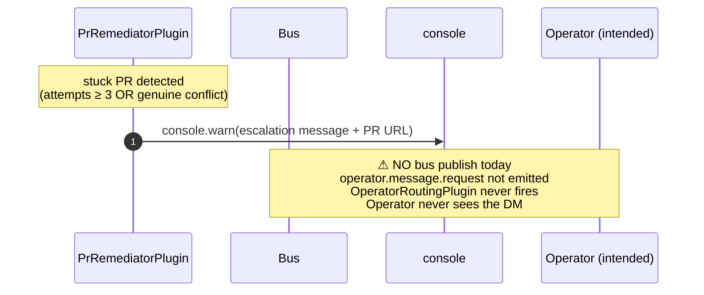

_When an autonomous loop gets stuck or hits a destructive-verdict guard, the intended escape valve is a Human-In-The-Loop escalation: ping the operator, surface the context, wait for direction. **Today this is wire-incomplete** — escalation sites log to console but do not publish a bus event. The operator-routing plumbing exists separately for `operator.message.request`, but the two are not connected._

---

## What & why

Bottlenecks are growth signals (see [memory: bottlenecks-are-growth](../../.claude/projects/-home-josh-dev-protoWorkstacean/memory/feedback_bottlenecks_are_growth.md)). A stuck autonomous loop should **escalate, not silently drop** — each escalation is a feature-request for the next layer of autonomy. HITL is the structural place to surface those.

The system has two pieces of HITL infrastructure, but they're not currently bridged:

| Piece | What it does | Source |
|---|---|---|
| **Escalation trigger sites** | Detect "this loop is stuck" or "this verdict is destructive on a protected target" and emit a warning | `lib/plugins/pr-remediator.ts:770,788,1072,1598` etc. |
| **Operator routing** | `OperatorRoutingPlugin` subscribes to `operator.message.request` and routes a payload to a Discord DM | `lib/plugins/operator-routing.ts:75–127` |

The gap: pr-remediator (and other escalation sites) **log to `console.warn`** but do not publish `operator.message.request`. So escalations are only visible to whoever is reading container logs — not surfaced to an operator interactively.

---

## ASCII spine (intended)

```
   stuck loop / destructive verdict / cooldown trip
                │
                ▼
   ┌──────────────────────────┐
   │  Escalation site         │  e.g. pr-remediator._emitStuckHitlEscalation()
   │   (multiple, scattered)  │
   │                          │
   │   today: console.warn    │  ← GAP: no bus event
   │   intended: publish      │
   │     hitl.request.*       │
   └──────────────┬───────────┘
                  │  (intended)
                  ▼
   ┌──────────────────────────┐
   │  operator.message.       │  topic shape OperatorMessageRequest
   │  request                 │  { message, urgency, topic, from }
   └──────────────┬───────────┘
                  ▼
   ┌──────────────────────────┐
   │  OperatorRoutingPlugin   │  reads workspace/users.yaml
   │   resolves operator      │  routes to:
   │   userId                 │
   └──────────────┬───────────┘
                  ▼
   ┌──────────────────────────┐
   │  message.outbound.       │
   │  discord.dm.user.{userId}│
   └──────────────┬───────────┘
                  ▼
            Operator's Discord DM
                  │
                  ▼  (response path not implemented today)
            ⚠ no inbound subscriber for operator reply
```

---

## What actually fires today



---

## Bus topic table (intended vs actual)

| Topic | Intended publisher | Actual publisher (audited) | Subscriber | Status |
|---|---|---|---|---|
| `operator.message.request` | pr-remediator escalation sites, dispatcher chokepoint trips | _(none in current source)_ | OperatorRoutingPlugin | ⚠ gap |
| `message.outbound.discord.dm.user.{userId}` | OperatorRoutingPlugin | OperatorRoutingPlugin | DiscordPlugin DM sink | ✅ wired |
| `hitl.request.pr.remediation_stuck.{correlationId}` | _docstring says pr-remediator emits this_ | _(none)_ | _(none)_ | ❌ aspirational |
| `hitl.response.*` | _(operator → bus)_ | _(none)_ | _(none)_ | ❌ aspirational |

The `OperatorRoutingPlugin` at [operator-routing.ts:75–127](../../lib/plugins/operator-routing.ts) is healthy and tested — it just has no current upstream publisher.

---

## Escalation trigger sites (today)

[pr-remediator.ts](../../lib/plugins/pr-remediator.ts):

| Site | Condition | What fires |
|---|---|---|
| `_emitStuckHitlEscalation` (line 770, 788) | attempt count ≥ `MAX_ATTEMPTS_PER_PR` (3) | `console.warn(PR URL + reason)` |
| `update_branch` 422 conflict handler (line 1072) | 422 from GitHub after 2+ attempts | dispatch `diagnose_pr_stuck` → LLM verdict |
| diagnose verdict "genuine" (line 1598) | LLM judges conflict is semantic | `console.warn` + `entry.escalated = true` |
| diagnose verdict "decomposable" on promotion PR (line 1536) | #465 destructive verdict guard | `console.warn` + suppress close |

None of these publish `operator.message.request` today.

---

## Operator-routing details (the half that works)

[operator-routing.ts](../../lib/plugins/operator-routing.ts):

```
on operator.message.request:
    payload: { message, urgency, topic, from }
    look up operator userId from workspace/users.yaml
    publish message.outbound.discord.dm.user.{userId}
        with payload.content = formatted message
```

[`workspace/users.yaml`](../../workspace/users.yaml) — operator list with Discord user IDs. The plugin reads this at install and routes by `urgency` field (could escalate to multiple operators in future; today it picks the first).

---

## Closing the gap

Minimum viable wiring to make escalation actually escalate:

1. **At each escalation site, publish `operator.message.request`** with the existing context (PR URL, reason, urgency). One-line additions next to each `console.warn`.
2. **Decide the inbound HITL path** — does an operator's Discord DM reply re-enter the bus as `hitl.response.*`? Or do they manually run a CLI / dashboard action? Not yet decided.

Both are open work. The escalation sites are the more urgent half — without them, the operator is in the dark by default.

---

## Failure modes & gotchas

- **Promotion-PR destructive guard is the most surface-visible HITL path today** (`#465`) — when Ava's verdict is `decomposable` on a release-pipeline PR, the close is suppressed but no operator notification fires. The PR sits with the LLM verdict text in a comment, no further action.
- **Live CI re-check before escalating `fix_ci`** (line 821–830) — prevents spurious "stuck on CI" escalation if CI flipped green. Good. But also masks the case where CI flipped green *because* something else fixed it, not because the original issue was resolved.
- **`InFlightEntry.escalated` is a one-shot flag** ([line 196](../../lib/plugins/pr-remediator.ts)) — once set, no further escalations on the same PR. If a real new failure mode appears, it's not re-escalated. Acceptable today (we don't have multiple operators); revisit if HITL becomes a queue.
- **`operator.message.request` is fire-and-forget** ([line 76](../../lib/plugins/operator-routing.ts)) — no acknowledgment topic. If the DM send fails, the publisher doesn't know. The OperatorRoutingPlugin logs failures but doesn't notify upstream.

---

## Related

- [chokepoint-invariants](chokepoint-invariants.md) — #465 is the most well-formed HITL escalation site
- [flow-alert-remediator](flow-alert-remediator.md) — pr-remediator hosts most escalation sites
- [flow-dashboard](flow-dashboard.md) — once escalations are bussed, the dashboard can count them
- [memory: bottlenecks-are-growth](../../.claude/projects/-home-josh-dev-protoWorkstacean/memory/feedback_bottlenecks_are_growth.md) — the design principle behind this flow
