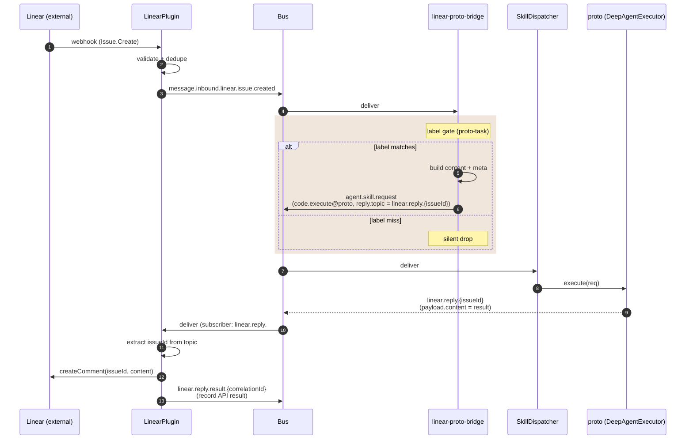

_A label-tagged Linear issue becomes a `code.execute` dispatch to the in-process `proto` agent. The bridge bypasses RouterPlugin's keyword/channel resolution and uses a `reply.topic` contract to round-trip the agent's response back to the Linear issue as a comment, with no bridge-side state._

---

## What & why

`RouterPlugin` resolves messages via channels + `skillHint` — neither concept fits a Linear *label* gate (which inspects the issue payload itself). One bridge fills the gap:

- **`linear-proto-bridge`** ([lib/plugins/linear-proto-bridge.ts](../../lib/plugins/linear-proto-bridge.ts)) — issues with the `proto-task` label dispatch `code.execute` to the in-process `proto` agent. Single global label gate; override via `LINEAR_PROTO_BRIDGE_LABEL` env. No per-team mapping — `proto` is one fleet-wide agent, not per-board.

> **There is no Linear → protoMaker board bridge.** The path that feeds protoMaker's board is `protomaker-board-bridge.ts`, which forwards **`github.issue.opened`** events (not Linear) to protoMaker's HTTP intake. protoMaker serves no `/a2a` endpoint. See [Related](#related).

### How this differs from the mention/assignment path

A Linear @mention or assigned-issue session is **not** a bridge concern. `LinearPlugin` stamps `skillHint: linear_agent_respond` on those events and `RouterPlugin` dispatches them to Ava. Linear inbound is otherwise **`skillHint`-only**: an un-hinted Linear event is never keyword-matched, so it drops. The `proto-task` label bridge is the one place a Linear event turns into a dispatch *without* a `skillHint` — it builds the `agent.skill.request` itself.

---

## ASCII spine

```
   Linear webhook
        │
        ▼
   ┌──────────────────────────┐
   │ LinearPlugin (inbound)   │  validates, dedupes
   └──────────────┬───────────┘
                  │
                  ▼
   ┌──────────────────────────┐
   │ message.inbound.linear.  │
   │   issue.created          │
   └──────────────┬───────────┘
                  │
                  ▼
          ┌────────────────┐
          │  proto bridge  │   subscribes to issue.created
          │                │
          │  label gate    │   default "proto-task"
          │  (env-         │   override LINEAR_PROTO_BRIDGE_LABEL
          │   overridable) │
          └───────┬────────┘
                  │
                  ▼
   ┌──────────────────────────┐
   │  agent.skill.request     │  skill=code.execute, targets=[proto]
   │                          │  reply.topic = linear.reply.{issueId}
   └──────────────┬───────────┘
                  ▼
              SkillDispatcher  (→ [flow-inbound-message](flow-inbound-message.md))
                  │
                  ▼
   ┌──────────────────────────┐
   │  linear.reply.{issueId}  │  ← executor publishes here
   └──────────────┬───────────┘
                  │  LinearPlugin subscribes (wildcard linear.reply.#)
                  ▼
            Linear API
        createComment(issueId, content)
```

---

## Sequence



---

## Bus topic table

| Topic | Published by | Subscribed by | File:line |
|---|---|---|---|
| `message.inbound.linear.issue.created` | LinearPlugin (webhook) | RouterPlugin (skillHint-only), linear-proto-bridge | `lib/plugins/linear.ts` |
| `agent.skill.request` (code.execute, proto) | linear-proto-bridge | SkillDispatcher | `lib/plugins/linear-proto-bridge.ts:105` |
| `linear.reply.{issueId}` | SkillDispatcher / executor (writes payload.content) | LinearPlugin outbound subscriber | `lib/plugins/linear.ts` |
| `linear.reply.result.{correlationId}` | LinearPlugin (after API call) | telemetry | `lib/plugins/linear.ts` |

---

## Gate logic

Single global label, env-overridable:

```
default:  proto-task
override: LINEAR_PROTO_BRIDGE_LABEL=<custom>
```

Gate sequence ([line 81–140](../../lib/plugins/linear-proto-bridge.ts)):
1. Drop if `issueId || title` missing (line 83)
2. Check `issue.labels.includes(this.triggerLabel)` — drop if absent (line 86–92)
3. Build `agent.skill.request` with skill `code.execute`, targets `["proto"]`, reply.topic `linear.reply.${issueId}` (line 105)

---

## Reply round-trip

The bridge sets `reply.topic = linear.reply.{issueId}` on dispatch. SkillDispatcher publishes the executor's response to that topic. LinearPlugin subscribes to `linear.reply.#` (excluding `linear.reply.result.*` to avoid a feedback loop) and:

1. Extracts `issueId` from the topic
2. Posts the comment (as Ava via actor=app OAuth when wired, else via `LINEAR_API_KEY`)
3. Publishes `linear.reply.result.{correlationId}` with the API result for audit

The bridge holds **no state** for round-trip — `reply.topic` is the entire close-the-loop contract, and `code.execute` is one-shot: dispatch, run to completion, reply.

---

## Failure modes & gotchas

- **Silent-drop on non-matching label** — by design. The mention/assignment path (`linear_agent_respond` to Ava) is independent and handles its own events.
- **No "task completed" close-the-loop** — when the agent's work eventually merges, no automatic comment lands on the originating Linear issue. The bridge only handles the *first* dispatch reply.
- **`correlationId` convention** — `linear-proto-${issueId}`. Not used for reply routing (that's `reply.topic`); used for tracing and `linear.reply.result.*` correlation.

---

## Related

- [integrations/linear](../integrations/linear) — full Linear plugin contract, the `linear_agent_respond` mention/assignment gate, and actor=app OAuth posting.
- [flow-inbound-message](flow-inbound-message.md) — what happens after the bridge publishes `agent.skill.request`.
- [integrations/github](../integrations/github) — the GitHub-issue → protoMaker board forwarder (`protomaker-board-bridge.ts`), the path people sometimes confuse with a Linear bridge.
- [flow-pr-review](flow-pr-review.md) — the analogous label-gated dispatch for GitHub PRs (no separate bridge, lives inside GitHubPlugin).
- [flow-hitl](flow-hitl.md) — what happens if the dispatched agent escalates.
