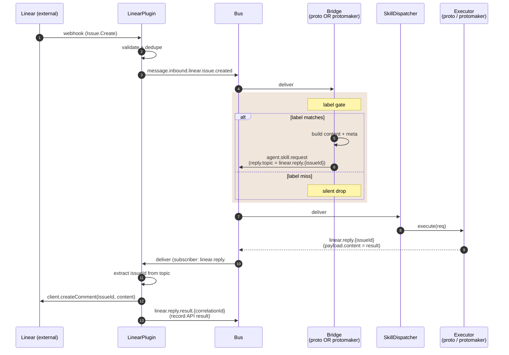

_Two near-identical bridges turn label-tagged Linear issues into agent dispatches. They bypass RouterPlugin and use a `reply.topic` contract to round-trip the agent's response back to the Linear issue as a comment, with no bridge-side state._

---

## What & why

`RouterPlugin` resolves chat messages via channels + keywords — neither concept fits a Linear *label* gate (which inspects the issue payload itself). Two bridges fill the gap:

- **`linear-protomaker-bridge`** ([lib/plugins/linear-protomaker-bridge.ts](../../lib/plugins/linear-protomaker-bridge.ts)) — issues with the team's configured trigger label dispatch `manage_feature` to `protomaker`. Configured per-team via `workspace/linear-board-mappings.yaml`.
- **`linear-proto-bridge`** ([lib/plugins/linear-proto-bridge.ts](../../lib/plugins/linear-proto-bridge.ts)) — issues with the `proto-task` label dispatch `code.execute` to the in-process `proto` agent. Single global label gate; override via `LINEAR_PROTO_BRIDGE_LABEL` env.

Both follow the same shape; only the gating logic and the target skill/agent differ.

---

## ASCII spine

```
   Linear webhook
        │
        ▼
   ┌──────────────────────────┐
   │ LinearPlugin (inbound)   │  validates, dedupes
   └──────────────┬───────────┘
                  │
                  ▼
   ┌──────────────────────────┐
   │ message.inbound.linear.  │
   │   issue.created          │
   └──────┬──────────────┬────┘
          │              │
          ▼              ▼
   ┌────────────┐  ┌────────────┐
   │ protomaker │  │   proto    │   each bridge subscribes
   │   bridge   │  │   bridge   │   independently
   │            │  │            │
   │ label gate │  │ label gate │   (different label per bridge)
   │ team       │  │ env-       │
   │ mapping    │  │ overridable│
   └─────┬──────┘  └─────┬──────┘
         │               │
         └───────┬───────┘
                 ▼
   ┌──────────────────────────┐
   │  agent.skill.request     │  reply.topic = linear.reply.{issueId}
   └──────────────┬───────────┘
                  ▼
              SkillDispatcher  (→ [flow-inbound-message](flow-inbound-message.md))
                  │
                  ▼
   ┌──────────────────────────┐
   │  linear.reply.{issueId}  │  ← executor publishes here
   └──────────────┬───────────┘
                  │  LinearPlugin subscribes (wildcard linear.reply.#)
                  ▼
            Linear API
        createComment(issueId, content)
```

---

## Sequence



---

## Bus topic table

| Topic | Published by | Subscribed by | File:line |
|---|---|---|---|
| `message.inbound.linear.issue.created` | LinearPlugin (webhook) | RouterPlugin, linear-protomaker-bridge, linear-proto-bridge | `lib/plugins/linear.ts` |
| `agent.skill.request` (manage_feature, protomaker) | linear-protomaker-bridge | SkillDispatcher | `lib/plugins/linear-protomaker-bridge.ts:178` |
| `agent.skill.request` (code.execute, proto) | linear-proto-bridge | SkillDispatcher | `lib/plugins/linear-proto-bridge.ts:106` |
| `linear.reply.{issueId}` | SkillDispatcher / executor (writes payload.content) | LinearPlugin._wireOutbound | `lib/plugins/linear.ts:561` |
| `linear.reply.result.{correlationId}` | LinearPlugin (after API call) | telemetry | `lib/plugins/linear.ts:567` |

---

## Gate logic

### linear-protomaker-bridge

Configured by **`workspace/linear-board-mappings.yaml`** ([line 96–100](../../lib/plugins/linear-protomaker-bridge.ts)):

```yaml
mappings:
  - linearTeamKey: ENG
    protoMakerProjectSlug: protoworkstacean
    triggerLabel: feature
```

Hot-reload: 5s file watcher. Schema validation is **fail-loud** — one malformed mapping rejects the whole file.

Gate sequence ([line 147–211](../../lib/plugins/linear-protomaker-bridge.ts)):
1. Drop if `issueId || teamKey || title` missing (line 149)
2. Look up mapping by `teamKey` — drop if not found (line 151)
3. Check `issue.labels.includes(mapping.triggerLabel)` — drop if absent (line 155)
4. Build `agent.skill.request` with skill `manage_feature`, targets `["protomaker"]`, reply.topic `linear.reply.${issueId}`

### linear-proto-bridge

Single global label, env-overridable:

```
default: proto-task
override: LINEAR_PROTO_BRIDGE_LABEL=<custom>
```

Gate sequence ([line 81–140](../../lib/plugins/linear-proto-bridge.ts)):
1. Drop if `issueId || title` missing (line 83)
2. Check `issue.labels.includes(this.triggerLabel)` — drop if absent (line 86–92)
3. Build `agent.skill.request` with skill `code.execute`, targets `["proto"]`, reply.topic `linear.reply.${issueId}`

No team mapping — proto is a single fleet-wide agent, not per-board.

---

## Reply round-trip

Both bridges set `reply.topic = linear.reply.{issueId}` on dispatch. SkillDispatcher publishes the executor's response to that topic. LinearPlugin subscribes to `linear.reply.#` (excluding `linear.reply.result.*` to avoid feedback loop) and:

1. Extracts `issueId` from the topic ([linear.ts:565](../../lib/plugins/linear.ts))
2. Calls `LinearClient.createComment(issueId, msg.payload.content)`
3. Publishes `linear.reply.result.{correlationId}` with API result for audit

The bridges hold **no state** for round-trip — `reply.topic` is the entire close-the-loop contract.

---

## Why two bridges, not one

Greenfield rule: "absence of a default = no behavior". The bridges differ in:

- **Configuration shape** (per-team mappings yaml vs. single env var)
- **Skill** (`manage_feature` vs. `code.execute`)
- **Target** (`protomaker` vs. `proto`)

A unified bridge would either need a routing table (over-engineering for two cases) or per-bridge configuration that essentially looks like the current two files. Two small bridges is the simpler shape — and both are no-op when their gate misses, so installing both unconditionally is safe.

---

## Failure modes & gotchas

- **Both bridges silent-drop on non-matching label** — by design. RouterPlugin's chat path still handles the issue via `channels.yaml` if a team's channel routes to a default agent. Bridges and router can coexist on the same inbound event.
- **No "feature completed" close-the-loop** — when the agent's work eventually merges, no automatic comment lands on the originating Linear issue. The bridge only handles the *first* dispatch reply; if the agent's reply is "I'll work on this and PR shortly", there's no async follow-up. See [protoMaker#3810](https://github.com/protoLabsAI/protoMaker/issues/3810) for the lifecycle event work that would close this.
- **Mapping yaml hot-reload re-validates everything** — a single bad mapping rejects the whole file. Restart-safe but operator gets one chance to see the warning.
- **`correlationId` convention** — `linear-bridge-${issueId}` (protomaker) or `linear-proto-${issueId}` (proto). Not used for reply routing (that's `reply.topic`); used for tracing and `linear.reply.result.*` correlation.

---

## Related

- [flow-inbound-message](flow-inbound-message.md) — what happens after the bridge publishes `agent.skill.request`
- [flow-pr-review](flow-pr-review.md) — the analogous label-gated dispatch for GitHub PRs (no separate bridge, lives inside GitHubPlugin)
- [flow-hitl](flow-hitl.md) — what happens if the dispatched agent escalates (HITL gap applies)
