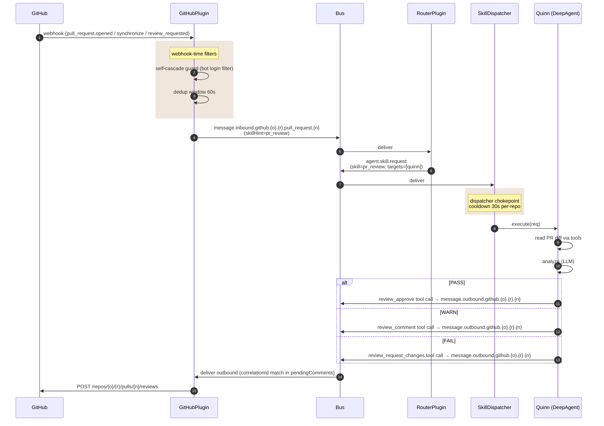

_Quinn reviews every PR opened against fleet repos. GitHub webhook → dispatch with `skillHint=pr_review` → Quinn issues a verdict (PASS / WARN / FAIL) via tool call → GitHub review (APPROVED / COMMENTED / CHANGES_REQUESTED). The self-cascade guard prevents agent-authored PRs from re-triggering the loop._

---

## What & why

GitHub PR events arrive on the same `message.inbound.github.*` topic as everything else, but with `skillHint=pr_review` pinned by `GitHubPlugin._handleAutoReview` ([github.ts:566–581](../../lib/plugins/github.ts)). That hint guarantees `pr_review` is dispatched even if RouterPlugin's keyword table would have routed elsewhere.

Quinn's executor (DeepAgent) executes `pr_review` and decides one of three verdicts via tool call:

| Quinn tool call | GitHub review event |
|---|---|
| `review_approve` | APPROVED |
| `review_comment` | COMMENTED |
| `review_request_changes` | CHANGES_REQUESTED |

These tool calls land on the PR-inspector HTTP backend (`POST /api/pr/inspect`, implemented in [`src/api/pr-inspector.ts`](../../src/api/pr-inspector.ts)), which authenticates as `@protoquinn[bot]` and POSTs the review to the GitHub REST API. On success it publishes `quinn.review.submitted` on the bus for any verdict-reactive subscriber (dashboards, embeds).

### Chokepoint invariant: terminal-CI guard

`pr-inspector.ts` enforces `guardTerminalCi` before a **formal** verdict (`APPROVE` / `REQUEST_CHANGES`) is posted. A formal verdict locks in a settled judgment — APPROVE enables auto-merge, REQUEST_CHANGES sets `reviewDecision` and blocks it — so it must not land while CI is still in flight:

- If any CI check is not yet terminal (`status !== "completed"`), the verdict is **held to COMMENT** (non-blocking). The formal PASS/FAIL lands on a later pass once every check is terminal. Repos with no checks at all are terminal by definition.
- The guard **fails closed**: an unknown CI state is never treated as terminal.

This is the same chokepoint-invariant shape as cooldown / target-guard / actor-filter / destructive-verdict (see [chokepoint-invariants](chokepoint-invariants.md)).

**CI-access (403) gap.** If the reviewer's token gets a `403` reading check-runs (an App-scope / reviewer-side access gap, surfaced as `CiAccessError`), the guard cannot confirm CI is terminal, so it also holds the verdict to COMMENT rather than locking one in on unverified CI. `check_ci` reports the 403 plainly; the formal verdict waits until CI is actually readable and terminal.

---

## ASCII spine

```
   GitHub PR webhook
        │
        ▼
   ┌──────────────────────────┐
   │ GitHubPlugin             │  ← self-cascade guard:
   │  _handleAutoReview()     │     drop if author ∈ {protoquinn[bot],
   │                          │       ava[bot], protobot[bot], …}
   │                          │     for non-PR events only
   │  dedup window 60s        │  ← drop duplicate PR pushes within window
   └──────────────┬───────────┘
                  │
                  ▼
   ┌──────────────────────────┐
   │ message.inbound.github.  │  payload: { skillHint: "pr_review",
   │   {owner}.{repo}.        │             reply.topic: outbound.github.… }
   │   pull_request.{n}       │
   └──────────────┬───────────┘
                  │
                  ▼  RouterPlugin (pass-through, skillHint wins)
                  ▼
   ┌──────────────────────────┐
   │  agent.skill.request     │  skill: pr_review
   │                          │  targets: [quinn]
   └──────────────┬───────────┘
                  ▼
            SkillDispatcher  (cooldown 30s per-repo, see #437)
                  │
                  ▼
   ┌──────────────────────────┐
   │  Quinn (DeepAgent)       │  prompted: "Issue your verdict (PASS/WARN/FAIL)
   │                          │             via review_approve /
   │                          │             review_comment /
   │                          │             review_request_changes."
   └──────────────┬───────────┘
                  │ tool call → POST /api/pr/inspect
                  ▼
   ┌──────────────────────────┐
   │ pr-inspector.ts          │  guardTerminalCi:
   │  (auth @protoquinn[bot]) │   APPROVE/REQUEST_CHANGES held to
   │                          │   COMMENT unless every CI check terminal
   └──────────────┬───────────┘
                  │ also publishes quinn.review.submitted
                  ▼
            GitHub REST API
        POST /repos/{owner}/{repo}/pulls/{n}/reviews
```

The chat-reply path (Quinn answering a comment, no verdict) still flows through `message.outbound.github.{o}.{r}.{n}` → `GitHubPlugin._postComment`. Only the formal verdict tools use the `pr-inspector.ts` backend.

---

## Sequence



---

## Bus topic table

| Topic | Published by | Subscribed by | File:line |
|---|---|---|---|
| `message.inbound.github.{o}.{r}.pull_request.{n}` | GitHubPlugin._handleAutoReview | RouterPlugin | `lib/plugins/github.ts:697,632` |
| `agent.skill.request` (skill=pr_review) | RouterPlugin (re-emits with target) | SkillDispatcher | `src/router/router-plugin.ts:272` |
| `agent.skill.response.{correlationId}` | SkillDispatcher | GitHubPlugin (pendingComments match) | `src/executor/skill-dispatcher-plugin.ts:96,182,195` |
| `message.outbound.github.{o}.{r}.{n}` | Quinn (chat-reply path, via tool call) | GitHubPlugin._postComment | `lib/plugins/github.ts:298,375` |
| `quinn.review.submitted` | PR-inspector backend (after a verdict posts) | dashboards / verdict-reactive subscribers | `src/api/pr-inspector.ts` |
| `flow.item.{created,updated,completed}` | SkillDispatcher | telemetry / dashboard PR-1/2/3 tiles | `src/executor/skill-dispatcher-plugin.ts:275,370,418` |

---

## "PR-1 / PR-2 / PR-3" — what those phases mean

The dashboard's PR review tiles aren't pipeline *phases* — they're three **states** in the `flow.item` lifecycle, observed by [flow-dashboard](flow-dashboard.md):

- **PR-1** — `flow.item.created` (dispatch started, Quinn assigned)
- **PR-2** — `flow.item.updated` (Quinn running, may publish progress)
- **PR-3** — `flow.item.completed` (verdict posted, GitHub review created)

Each tile counts items in each state. There is **no formal phase boundary** in source — the names are dashboard nomenclature.

---

## Self-cascade guard

[github.ts:524–542](../../lib/plugins/github.ts) drops webhook events authored by known bots:

```
authorLogins to drop: protoquinn[bot], ava[bot], protobot[bot], …
```

**Critical:** PR events are *intentionally not filtered*. If Quinn opens a PR (e.g. autonomous tech-debt PR), Quinn still gets to review it. Filtering is only on issue/comment events — preventing Quinn → file issue → webhook → Quinn-files-another-issue cascade ([protoWorkstacean#556](https://github.com/protoLabsAI/protoWorkstacean/issues/556)).

---

## Dedup window

60s sliding window keyed by `(owner/repo, number)` ([github.ts:656](../../lib/plugins/github.ts)). Prevents fast-rebase floods (`git push --force` storms) from triggering N reviews. **Race:** if a real new commit lands within the 60s window, it doesn't trigger a review until the window clears. Acceptable today (PR review is best-effort, not real-time); revisit if it bites.

Note this is separate from #437 cooldown (which is per-skill-per-repo and 30s) — both apply, dedup at the webhook tier and cooldown at the dispatcher tier.

---

## Correlation ID chain

`correlationId` flows: webhook → inbound → router → dispatcher → outbound. GitHubPlugin stores `(owner, repo, number)` keyed by correlationId in `pendingComments` Map ([github.ts:621,683–684](../../lib/plugins/github.ts)) so the outbound subscriber knows which PR a reply belongs to.

**Fragile if dropped:** if any layer fails to forward `correlationId`, the reply still gets posted but to the wrong endpoint (or the lookup fails and it's orphaned). RouterPlugin and SkillDispatcher both preserve it by convention — but there's no enforcement.

---

## Failure modes & gotchas

- **Cooldown silently drops review #2 within 30s** — if a PR is opened and immediately rebased, the second event hits dispatcher cooldown and silently drops. Operator sees no review for the second push. Visible only in `console.warn`. See [chokepoint-invariants](chokepoint-invariants.md) re: missing dispatch-drop telemetry.
- **No timeout on Quinn's execution** — same as the general dispatcher gap; Quinn could hang indefinitely on a large diff. Mitigation: DeepAgent has its own `maxTurns` limit and per-tool timeouts.
- **Formal verdicts are guarded, not unconditional** — a `review_approve` / `review_request_changes` tool call does **not** unconditionally post that GitHub review. `guardTerminalCi` (in `pr-inspector.ts`) downgrades it to COMMENT whenever CI is still pending or unreadable (403). So a verdict tool call carries a real contract: it posts the formal review only once every CI check is terminal. Quinn may also issue no verdict at all (just a chat reply), in which case no formal review event is created.
- **Self-cascade guard does NOT apply to PRs** — by design. Quinn-authored PRs *should* be reviewed. If Quinn ever starts auto-resolving its own reviews (approving her own PR), it would loop. Watch for that.

---

## Related

- [flow-inbound-message](flow-inbound-message.md) — the underlying transport
- [chokepoint-invariants](chokepoint-invariants.md) — #465 destructive-verdict guard, which sits inside `pr-remediator` (not Quinn), but related to the verdict pattern
- [flow-alert-remediator](flow-alert-remediator.md) — PR remediator handles `update_branch` / `fix_ci` / `address_feedback` actions that follow up on review verdicts
- [flow-dashboard](flow-dashboard.md) — PR-1/-2/-3 tiles
