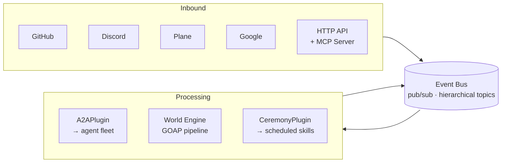
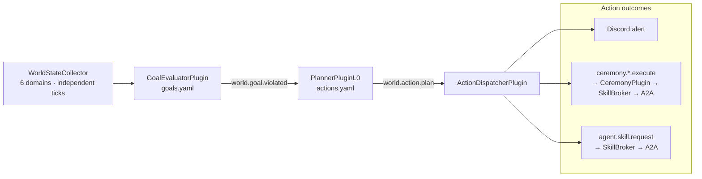

# Architecture — How protoWorkstacean Works

_This is an explanation doc. It explains the design decisions, concepts, and how components connect — not how to use them._

---

## What protoWorkstacean is

protoWorkstacean is a personal agent orchestration platform. It coordinates a fleet of specialized AI agents (Quinn, Ava, Frank, Jon, Cindi, Researcher) across GitHub, Discord, Plane, and Google Workspace. Every interaction — a GitHub PR, a Discord @mention, a scheduled cron, a Plane issue — enters the system as a message on the same in-process event bus.

The key architectural decision is that **the bus is the only communication channel**. No plugin talks directly to another plugin. No plugin talks directly to an agent. Everything goes through the bus.

---

## The event bus



The bus is an in-process pub/sub system with MQTT-style hierarchical topic matching. `#` matches any number of path segments:

- `message.inbound.#` catches everything entering the system
- `message.inbound.discord.#` catches only Discord messages
- `message.inbound.discord.1234567890` catches one specific channel

This topic hierarchy is the routing backbone. Plugins subscribe narrowly — each plugin only sees the messages it cares about.

---

## The plugin layer

Plugins are the adapters between the outside world and the bus. Each plugin:

1. Listens for external events (GitHub webhooks, Discord gateway events, Plane webhooks, cron timers)
2. Validates and normalizes the event into a `BusMessage`
3. Publishes the `BusMessage` on the appropriate `message.inbound.*` topic

And in the other direction:

1. Subscribes to `message.outbound.*` topics
2. Delivers the outbound message to the external service (posts a GitHub comment, sends a Discord message, patches a Plane issue)

Plugins are symmetric — they bridge in both directions, but they don't process the content. They don't decide what to say. That's the agent's job.

---

## The A2A plugin

The A2APlugin is the bridge between the bus and the agent fleet. It:

1. Subscribes to `message.inbound.#` and `cron.#`
2. Matches each message to a skill (explicit hint → keyword → default Ava)
3. Calls the appropriate agent via JSON-RPC 2.0 (`message/send`)
4. Publishes the agent's response to the appropriate `message.outbound.*` topic

The agent fleet is defined in `workspace/agents.yaml`. The A2APlugin doesn't know anything about what agents do — it only knows which topics to route to which agents.

---

## Message flow: end-to-end

```
Discord @mention
  ↓
DiscordPlugin validates, publishes message.inbound.discord.{channelId}
  ↓
A2APlugin keyword-matches → routes to Ava (sitrep)
  ↓
callA2A(ava, content, contextId) — JSON-RPC 2.0 HTTP call
  ↓
Ava processes, returns response
  ↓
A2APlugin publishes message.outbound.discord.{channelId}
  ↓
DiscordPlugin sends Discord reply
```

This same pattern holds for every interface: GitHub → GitHubPlugin → bus → A2APlugin → agent → bus → GitHubPlugin → GitHub comment.

---

## Quinn's vector context pipeline

Quinn extends this pattern with a multi-step retrieval pipeline before the LLM call:

```
PR opened/synchronize
  → GitHubPlugin → message.inbound.github.*
  → A2APlugin → Quinn (pr_review skill)
  → runReviewPipeline(diff, repo, pr)
      ├── parseDiff + extractSymbols
      ├── Qdrant: retrieveAllPastPRDecisions (quinn-pr-history)
      ├── Qdrant: findAllSimilarPatterns (quinn-code-patterns)
      ├── formatCodebaseContext + applyTokenBudget (20% cap)
      └── assembleReviewPrompt → LLM call
```

The Qdrant collections are populated as PRs are merged:

```
PR merged
  → fetchPRDiff + fetchReviewDecision
  → chunkDiff → embed → quinn-pr-history
  → extractSymbols → fetchSymbolContexts → quinn-code-patterns
```

Developer dismissals are tracked in `quinn-review-learnings` and used to suppress low-signal comment patterns over time.

---

## The World Engine

The World Engine is a second major system alongside the A2A routing pipeline. Where A2A is reactive (respond to an event), the World Engine is **homeostatic** — it continuously measures system state against declared goals and autonomously acts to close deviations.

Four plugins compose the pipeline:

1. **WorldStateCollector** — six independent tickers collect domain state: `services` (30s), `board` (60s), `CI` (5min), `portfolio` (15min), `security` (30s), `agent_health` (60s). Results are merged into a single `WorldState` snapshot.
2. **GoalEvaluatorPlugin** — evaluates every goal in `goals.yaml` against the current snapshot. When a goal is violated, publishes `world.goal.violated`.
3. **PlannerPluginL0** — on `world.goal.violated`, scans `actions.yaml` for applicable tier_0 actions (matching goal + preconditions), selects the highest-priority set, and publishes `world.action.plan`.
4. **ActionDispatcherPlugin** — executes the plan. For `fireAndForget: true` actions (alerts, ceremonies), it publishes to the action's topic immediately and marks complete. WIP limit: 5 concurrent non-fire-and-forget actions.



Goals and actions are **declarative YAML** — adding a new monitored condition requires only an entry in `goals.yaml` and a matching action in `actions.yaml`. No code change needed.

---

## The MCP server

`mcp/server.ts` is a stdio MCP server that exposes the bus to Claude Code agents. It wraps the HTTP API and provides typed tools: `report_incident`, `report_bug`, `get_world_state`, `publish`, `run_ceremony`, and others. All tools accept a `projectSlug` parameter that flows through the event payload to route downstream work to the correct project's agents and board.

This closes the loop: a Claude Code session can report an incident → the incident enters `incidents.yaml` → the security domain surfaces it in world state → GOAP fires the alert and triage ceremony → Quinn triages it and files a board issue.

---

## The HITL gate

The HITL (human-in-the-loop) gate is the approval checkpoint for the `plan` skill. It exists because plan execution has permanent side effects: board features, Plane state changes, Discord channel provisioning.

The design principle: **the bus is dumb, interface plugins own rendering, Ava owns plan state**.

- When Ava's `plan` skill finishes, it publishes an `HITLRequest` to the bus with the PRD summary and review scores
- The originating interface plugin (Discord, Plane, API) receives the `HITLRequest` and renders it natively — Discord gets interactive buttons, Plane gets a comment
- The human responds; the interface plugin publishes an `HITLResponse` on the bus
- The A2APlugin routes to Ava's `plan_resume` skill, which restores the SQLite checkpoint and creates the board features

Adding a new interface (Slack, voice, SMS) requires only implementing the renderer — no changes to Ava, the bus, or the HITL plugin.

`correlationId` is the thread connecting every message in the plan lifecycle. Set once at the inbound message and stamped on every downstream artifact.

---

## Service layer

Quinn's vector pipeline uses a dedicated service layer in `src/services/`:

| Package | Responsibility |
|---|---|
| `qdrant/client.ts` | Qdrant REST API client (5s timeout, fallback on error) |
| `embeddings/ollama-client.ts` | Ollama embedding API (nomic-embed-text) |
| `diff/chunker.ts` | Parse unified diff, chunk large files |
| `diff/symbol-extractor.ts` | Route to language-specific symbol extractors |
| `reviews/review-pipeline.ts` | Orchestrate full context retrieval pipeline |
| `reviews/context-formatter.ts` | Format the `CODEBASE CONTEXT` block |
| `reviews/token-budgeter.ts` | Enforce 20% token budget cap |

---

## External services

| Service | URL | Purpose |
|---|---|---|
| Qdrant | `http://qdrant:6333` | Vector search and storage |
| Ollama | `http://ollama:11434` | Local LLM and embedding inference |
| GitHub API | `https://api.github.com` | PR data, diffs, comments |
| Plane | configured via `PLANE_API_URL` | Project management |
| Discord | bot token | Team notifications |

---

## Design principles

1. **Bus is dumb** — routes messages, no business logic
2. **Plugins are thin** — validate, normalize, publish, deliver. No content decisions.
3. **Agents are stateless from the bus's perspective** — state lives in SQLite (PlanStore), Qdrant, or the agent itself
4. **`correlationId` is the spine** — threads any multi-hop flow without the bus needing to understand it
5. **Adding a surface requires only a plugin** — new Discord slash commands, new render targets for HITL, new external webhooks — none require touching core routing logic
