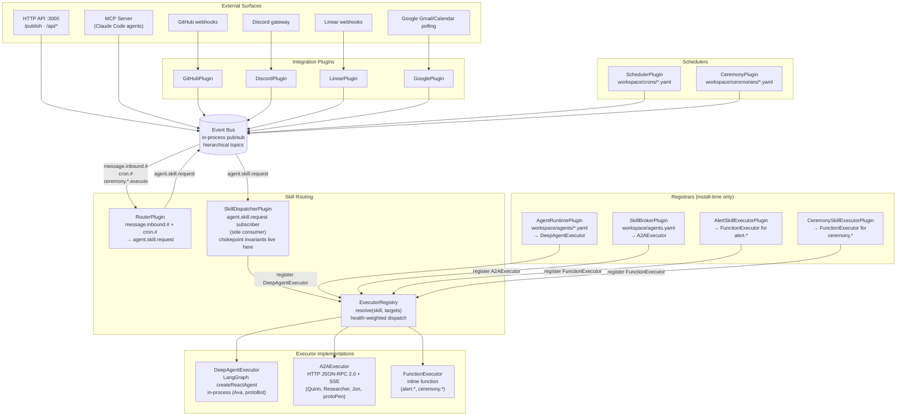

_Conceptual overview of how protoWorkstacean's components connect and why they are designed the way they are._

---

## System overview

protoWorkstacean is a **switchboard**. Triggers come in from the outside world or from a scheduler, the router resolves them to a skill, the dispatcher routes them to the right executor, and the executor runs the skill (locally in a DeepAgent, remotely over A2A, or as a function handler).



---

## The event bus

The bus is the only communication channel. No plugin talks directly to another plugin — everything goes through `bus.publish()` and `bus.subscribe()`. Topic matching is hierarchical: `#` matches anything, `*` matches one segment.

This constraint is what makes the system composable. Adding Discord support doesn't touch the GitHub plugin. Adding a new executor type doesn't touch the routing logic. Plugins are independently installable and testable.

---

## Executor layer

The executor layer is the unified dispatch path for all agent skill calls. It separates registration from dispatch:

- **Registrars** (`AgentRuntimePlugin`, `SkillBrokerPlugin`, plus the function-executor registrars for `alert.*` / `ceremony.*`) — register executors into `ExecutorRegistry` at `install()` time. No bus subscriptions.
- **Dispatcher** (`SkillDispatcherPlugin`) — sole subscriber to `agent.skill.request`, delegates to the registry.

```
agent.skill.request
  → SkillDispatcherPlugin
    ├── chokepoint invariants (cooldown, target-registry guard;
    │   synthetic-actor filter lives downstream at fleet-health)
    └── ExecutorRegistry.resolve(skill, targets?)
       1. Named target: any registration whose agentName ∈ targets[]
       2. Skill match: highest priority registration where skill matches
          (health-weighted random selection when fleet metrics available)
       3. Default executor
       4. null → error response, message dropped
    → executor.execute(SkillRequest)
      → result published to replyTopic
```

`SkillRequest` carries `correlationId` (trace-id) and `parentId` (parent span-id), set by `SkillDispatcherPlugin` from the triggering bus message.

---

## Scheduling

Two related but distinct primitives:

- **Crons** (`workspace/crons/*.yaml`, served by `SchedulerPlugin`) — generic time-based triggers. Each yaml defines `schedule` (cron expression or ISO datetime for one-shot), `topic`, `payload`. Hot-reloaded every 5 seconds.
- **Ceremonies** (`workspace/ceremonies/*.yaml`, served by `CeremonyPlugin`) — named, observable rituals. Each ceremony has a `schedule`, a `skill`, `targets`, optional Discord notification, and persistent outcome history. Can also be triggered on-demand by a skill caller via the `ceremony.*` FunctionExecutor.

Use a cron when you just need a topic fired on a schedule. Use a ceremony when you want the schedule to dispatch a specific skill on a specific agent and have the outcomes show up in `/api/ceremonies`.

---

## Distributed tracing

Every `BusMessage` carries:

| Field | Role | Changes? |
|---|---|---|
| `correlationId` | W3C trace-id — links every message in a request tree | Never |
| `parentId` | Parent span-id — = triggering message's `id` | At each hop |

`RouterPlugin` sets `parentId` when translating inbound messages to `agent.skill.request`. `A2AExecutor` forwards both as `X-Correlation-Id` and `X-Parent-Id` HTTP headers. External A2A agents propagate `X-Correlation-Id` into their internal chat calls. When `LANGFUSE_PUBLIC_KEY` + `LANGFUSE_SECRET_KEY` are set, DeepAgent calls produce spans in Langfuse.

See [Distributed Tracing](./distributed-tracing).

---

## Message routing conventions

```
message.inbound.github.<owner>.<repo>.<event>.<number>   — inbound from GitHub
message.outbound.github.<owner>.<repo>.<number>          — outbound to GitHub comment
message.inbound.discord.<channelId>                      — inbound from Discord
message.outbound.discord.<channelId>                     — outbound to Discord
message.inbound.linear.<event>                           — inbound from Linear webhook
message.inbound.google.<gmail|calendar>                  — inbound from Google polling
agent.skill.request                                      — route to agent via SkillDispatcher
agent.skill.response.<correlationId>                     — default reply topic
ceremony.<id>.execute                                    — trigger named ceremony
autonomous.outcome.<systemActor>.<skill>                 — terminal outcome for any skill dispatch
```

---

## What this app is NOT

- It is **not** a GOAP system. There is no world-state engine, no goal evaluator, no planner. Earlier versions had one; it was a baroque polling loop and was removed. If you're tempted to add a "world model" or "planner" or "goal," stop and ask whether a cron or a webhook would do the same job. It almost always will.
- It is **not** an agent itself. It hosts agents (DeepAgent in-process, A2A remote) but the routing and scheduling layer has no agency.
- It is **not** a workflow engine. Ceremonies are scheduled fleet rituals, not orchestrated multi-step workflows.
