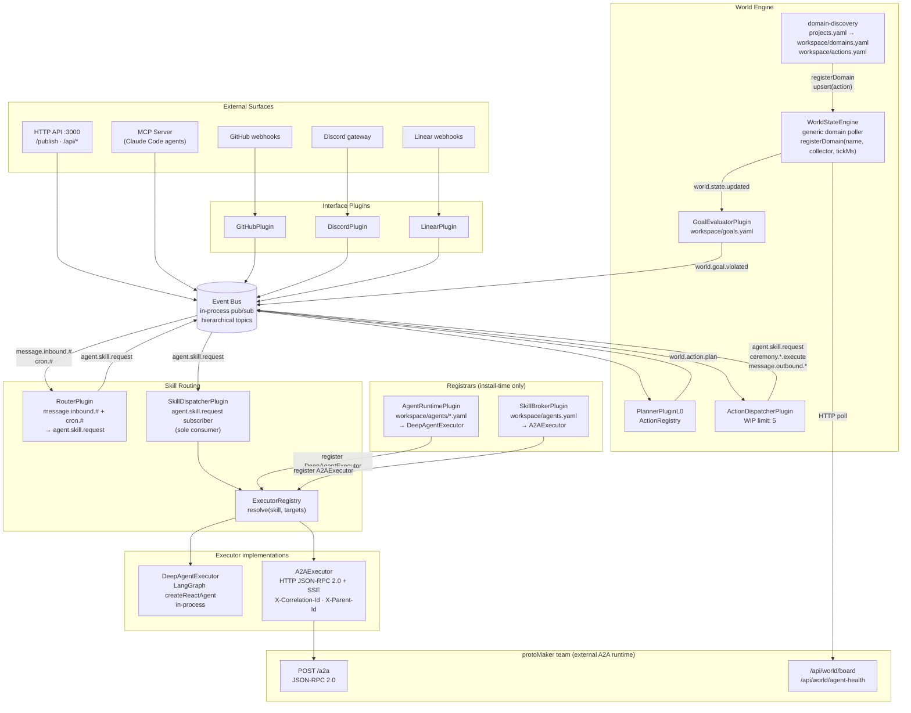
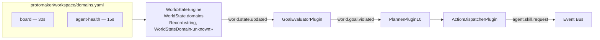

_Conceptual overview of how protoWorkstacean's components connect and why they are designed the way they are._

---

## System overview



---

## The event bus

The bus is the only communication channel. No plugin talks directly to another plugin — everything goes through `bus.publish()` and `bus.subscribe()`. Topic matching is hierarchical: `#` matches anything, `*` matches one segment.

This constraint is what makes the system composable. Adding Discord support doesn't touch the GitHub plugin. Adding a new executor type doesn't touch the routing logic. Plugins are independently installable and testable.

---

## Executor layer

The executor layer is the unified dispatch path for all agent skill calls. Before it existed, `AgentPlugin` and `A2APlugin` both subscribed to `agent.skill.request` and raced for messages. Adding a third agent type required a third subscriber.

The executor layer fixes this with a clean separation:

- **Registrars** (`AgentRuntimePlugin`, `SkillBrokerPlugin`) — register executors into `ExecutorRegistry` at `install()` time, no bus subscriptions
- **Dispatcher** (`SkillDispatcherPlugin`) — sole subscriber to `agent.skill.request`, delegates to the registry

```
agent.skill.request
  → SkillDispatcherPlugin
    → ExecutorRegistry.resolve(skill, targets?)
      1. Named target: any registration whose agentName ∈ targets[]
      2. Skill match: highest priority registration where skill matches
      3. Default executor
      4. null → error response, message dropped
    → executor.execute(SkillRequest)
      → result published to replyTopic
```

`SkillRequest` carries `correlationId` (trace-id) and `parentId` (parent span-id), set by `SkillDispatcherPlugin` from the triggering bus message.

See [Executor Layer](./executor-layer) for the full design rationale.

---

## World Engine — GOAP homeostatic loop

The `WorldStateEngine` is completely generic. It knows nothing about boards, agents, or CI. All domain knowledge lives in the protoMaker team's `workspace/domains.yaml`.

Domain discovery runs at startup:

```
WORKSPACE_DIR/projects.yaml
  → for each project with projectPath:
      {projectPath}/workspace/domains.yaml   → engine.registerDomain(name, httpCollector, tickMs)
      {projectPath}/workspace/actions.yaml   → actionRegistry.upsert(action)
```

Domain URLs support `${ENV_VAR}` interpolation. The protoMaker team server exposes `/api/world/board` and `/api/world/agent-health` as pollable endpoints.



See [World Engine](./world-engine) for the design rationale.

---

## Distributed tracing

Every `BusMessage` carries:

| Field | Role | Changes? |
|---|---|---|
| `correlationId` | W3C trace-id — links every message in a request tree | Never |
| `parentId` | Parent span-id — = triggering message's `id` | At each hop |

`RouterPlugin` sets `parentId` when translating inbound messages to `agent.skill.request`. `A2AExecutor` forwards both as `X-Correlation-Id` and `X-Parent-Id` HTTP headers. External A2A agents (the protoMaker team, Quinn, protoContent) propagate `X-Correlation-Id` into their internal chat calls.

See [Distributed Tracing](./distributed-tracing).

---

## Message routing conventions

```
message.inbound.github.<owner>.<repo>.<event>.<number>   — inbound from GitHub
message.outbound.github.<owner>.<repo>.<number>          — outbound to GitHub comment
message.inbound.discord.<channelId>                      — inbound from Discord
message.outbound.discord.<channelId>                     — outbound to Discord
agent.skill.request                                      — route to agent via SkillDispatcher
ceremony.<id>.execute                                    — trigger named ceremony
world.goal.violated                                      — GOAP goal deviation detected
world.action.plan                                        — planner output ready for dispatch
security.incident.reported                               — immediate domain recollect
```
